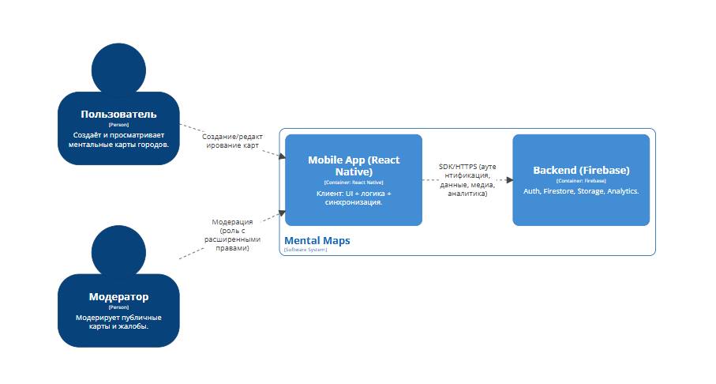
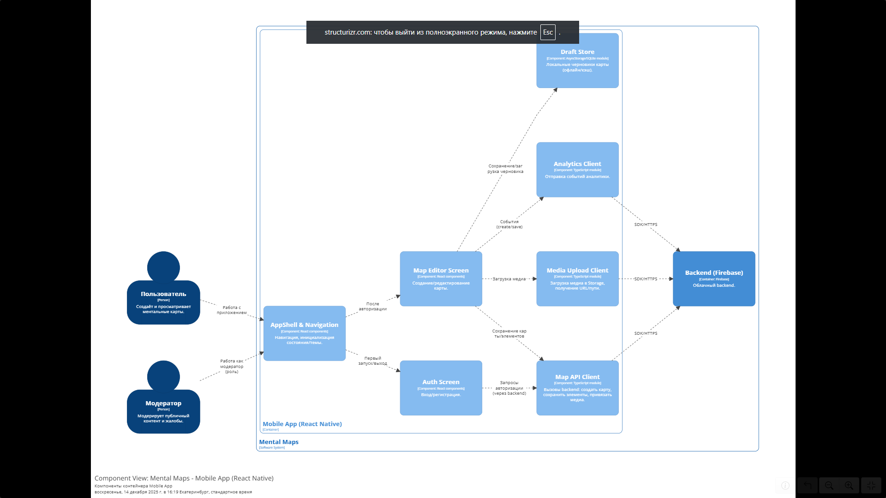
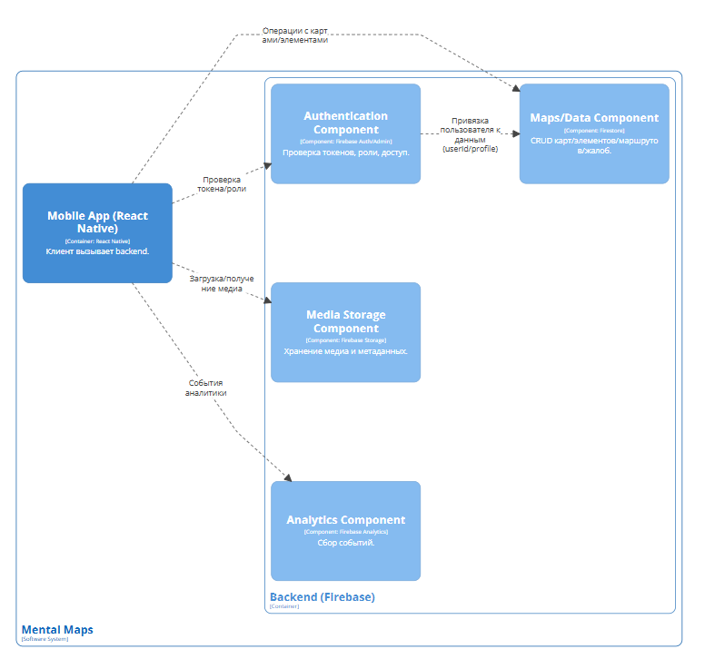
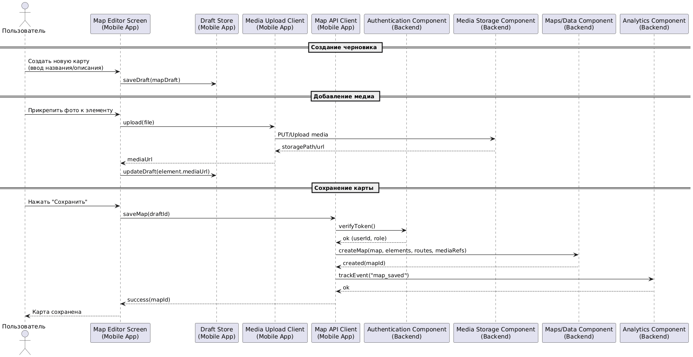
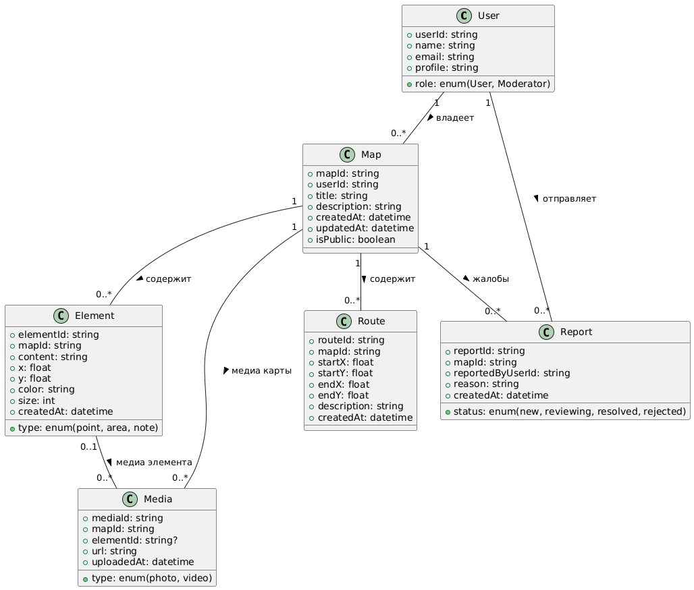

# Лабораторная работа №3  
**Тема:** Использование принципов проектирования на уровне методов и классов  
**Проект:** мобильное приложение «Mental Maps»

---

## 1. Цель работы

Цель лабораторной работы — показать, как выбранный вариант использования реализуется на уровне архитектуры и кода с учётом принципов **KISS, YAGNI, DRY, SOLID**, а также оценить применимость (или отказ) от дополнительных принципов разработки: **BDUF, SoC, MVP, PoC**.

---

## 2. Выбранный вариант использования

### UC-03: Создание ментальной карты с элементами и медиа (и сохранение в облаке)

**Участники:** Пользователь (основной), Backend (Firebase) как внешняя интеграция.

**Сценарий (кратко):**
1. Пользователь открывает экран создания новой карты.
2. Вводит название и описание.
3. Добавляет элементы карты (например: точка, область, заметка), настраивает параметры элемента (координаты, размер, цвет, текст).
4. Прикрепляет медиа (фото/видео) к одному или нескольким элементам.
5. Нажимает «Сохранить».
6. Приложение сохраняет карту и элементы в хранилище данных, загружает медиа в файловое хранилище и отправляет события аналитики.
7. Пользователь получает подтверждение успешного сохранения.

**Результат выполнения UC:** созданная карта хранится в облаке и доступна пользователю при следующем входе/синхронизации.

---

## 3. Диаграммы C4: контейнеров и компонентов

### 3.1. Диаграмма контейнеров (C4 Container Diagram)

**Что показывает:**  
Разбиение системы «Mental Maps» на крупные части (контейнеры) и связи между ними.

**Основные элементы:**
- **Mobile App (React Native)** — клиентское приложение на устройстве.  
  Отвечает за пользовательский интерфейс, создание/редактирование карты, работу с локальными черновиками и синхронизацию.
- **Backend (Firebase)** — облачная платформа.  
  Обеспечивает аутентификацию, хранение данных карт, хранение медиа и сбор аналитики.

**Связь контейнеров:**  
Клиентское приложение обращается к Firebase для:
- аутентификации пользователя;
- чтения/записи данных карт и элементов;
- загрузки/получения медиа;
- отправки событий аналитики.

---

### 3.2. Диаграмма компонентов (C4 Component Diagram)

> В рамках ЛР3 достаточно представить диаграмму компонентов для одного контейнера (базово) и ещё одну диаграмму компонентов для другого контейнера (повышенная сложность).

#### A) Диаграмма компонентов контейнера **Mobile App (React Native)**

**Что показывает:**  
Какие внутренние компоненты приложения участвуют в реализации UC-03 и как они взаимодействуют.

**Пример состава компонентов:**
- **AppShell & Navigation** — старт приложения, навигация по экранам, глобальные состояния.
- **Auth Screen** — вход/регистрация (нужно для доступа к данным пользователя).
- **Map Editor Screen** — основной экран UC-03: создание/редактирование карты и элементов.
- **Draft Store (Local Storage)** — хранение черновиков карты и элементов локально (офлайн/кэш).
- **Media Upload Client** — загрузка медиа и получение ссылки/идентификатора.
- **Map API Client** — сохранение карты и элементов в облако.
- **Analytics Client** — отправка событий (например, «карта сохранена»).

**Ключевая идея:**  
UI-компоненты не делают напрямую сложные операции сохранения — они делегируют работу специализированным модулям (хранилище/сетевой клиент/загрузка медиа). Это облегчает поддержку и делает код ближе к принципам SoC и SOLID.

#### B) Диаграмма компонентов контейнера **Backend (Firebase)** (повышенная сложность)

**Что показывает:**  
Какие логические компоненты backend отвечают за разные аспекты UC-03.

**Пример состава компонентов:**
- **Authentication Component** — проверка токена, роль пользователя, доступ.
- **Maps/Data Component (Firestore)** — хранение карт, элементов, маршрутов и связанных данных.
- **Media Storage Component (Storage)** — хранение файлов и метаданных медиа.
- **Analytics Component** — сбор событий аналитики.

**Ключевая идея:**  
Backend разделён по зонам ответственности: отдельно авторизация, отдельно данные, отдельно медиа и отдельно аналитика.

---

## 4. Диаграмма последовательностей (UC-03)

**Что показывает:**  
Пошаговое взаимодействие компонентов (из C4-диаграмм) в рамках сценария UC-03.

**Смысл диаграммы для UC-03:**
- Пользователь работает в **Map Editor Screen**.
- Черновики (элементы/описания) сохраняются локально через **Draft Store**.
- Медиа загружается через **Media Upload Client**, который взаимодействует с backend-хранилищем.
- Сохранение карты инициируется через **Map API Client**, который проверяет авторизацию и записывает данные карты в хранилище.
- После успешного сохранения отправляется событие через **Analytics Client / Analytics Component**.

---

## 5. Модель БД (UML диаграмма классов)

**Что показывает:**  
Структуру данных приложения на уровне сущностей и связей между ними.

**Сущности (минимум 5):**
- **User** — пользователь системы (включая роль: пользователь/модератор).
- **Map** — ментальная карта (название, описание, владелец, публичность).
- **Element** — элемент карты (координаты, тип, контент, стиль).
- **Media** — медиафайл (URL/путь, тип, привязка к карте и/или элементу).
- **Route** — маршрут (начальная/конечная точки, описание).
- **Report** — жалоба на публичную карту (для сценариев модерации).

**Логика связей:**
- У одного пользователя может быть много карт.
- Карта содержит элементы и маршруты.
- Медиа может быть привязано к карте целиком или к конкретному элементу.
- На карту могут поступать жалобы от пользователей, которые обрабатываются модератором.

---

## 6. Принципы KISS, YAGNI, DRY, SOLID — как учтены в реализации (пояснение без кода)

> Код клиентской и серверной части добавлен отдельно. Здесь — пояснение, какие решения приняты, чтобы соответствовать принципам.

### 6.1. KISS (Keep It Simple)

**Как применено:**
- Каждая часть системы делает только очевидную и ограниченную задачу:  
  UI — отображение и сбор данных,  
  клиентский сетевой слой — запросы к backend,  
  backend — хранение данных и проверка доступа.
- В UC-03 используется минимально необходимая логика: «создать карту → добавить элементы → загрузить медиа → сохранить».

**Почему это важно:**  
простые решения легче тестировать, поддерживать и расширять без ошибок.

---

### 6.2. YAGNI (You Aren’t Gonna Need It)

**Как применено:**
- В реализации UC-03 закладываются только реально нужные функции: сохранение карты, загрузка медиа, базовая валидация.
- Не добавляются заранее “про запас” сложные механизмы: версии карт, расширенный поиск, рекомендации, сложные сценарии доступа.

**Почему это важно:**  
снижает объём лишнего кода и риск «сломать» систему из-за ненужной заранее функциональности.

---

### 6.3. DRY (Don’t Repeat Yourself)

**Как применено:**
- Сетевые запросы и работа с данными вынесены в общие модули (клиент API, загрузка медиа), а не дублируются внутри каждого экрана.
- Повторяющиеся операции (обработка ошибок, формирование payload для сохранения) выполняются в одном месте.

**Почему это важно:**  
меньше дублирования → меньше расхождений в логике → проще исправлять и расширять.

---

### 6.4. SOLID

**S — Single Responsibility Principle (SRP):**  
- UI-экраны отвечают за интерфейс.
- Use-case/сервис сохранения отвечает за сценарий «сохранить карту».
- Репозиторий/адаптер отвечает за запись данных в хранилище.
- Компонент медиа отвечает за работу с файлами.

**O — Open/Closed Principle (OCP):**  
- Система расширяема: можно добавлять новые типы элементов или способы хранения без переписывания существующих модулей, если они работают через интерфейсы.

**L — Liskov Substitution Principle (LSP):**  
- Реализации компонентов хранения/сетевого слоя должны быть взаимозаменяемы (например, другой storage/кэш), не ломая контракт использования.

**I — Interface Segregation Principle (ISP):**  
- Интерфейсы небольшие и конкретные (например, отдельный контракт на сохранение карты, отдельный — на работу с черновиками).

**D — Dependency Inversion Principle (DIP):**  
- UI и бизнес-логика зависят от абстракций (интерфейсов), а не от конкретных реализаций Firebase/Storage.  
  Это упрощает тестирование и замены реализации.

---

## 7. Повышенная сложность: принципы разработки (обоснование применимости/отказа)

### 7.1. BDUF — Big Design Up Front («масштабное проектирование прежде всего»)

**Суть:**  
перед разработкой детально проектировать систему целиком (архитектура, данные, интерфейсы, сценарии).

**Применимость к проекту Mental Maps:** **частично применимо**.

**Почему частично:**
- Полезно заранее продумать архитектуру (C4) и модель данных, чтобы не «перепридумывать» базу на ходу.
- Но проект развивается итеративно: требования могут уточняться (например, новые варианты обмена картами, режимы приватности). Если проектировать всё “до конца” заранее — можно потратить время на неактуальные решения.

**Вывод:**  
используется «умеренный BDUF»: проектируются ключевые части (контейнеры, компоненты, данные), но детали развиваются итеративно.

---

### 7.2. SoC — Separation of Concerns (принцип разделения ответственности)

**Суть:**  
каждый модуль системы отвечает за свою область задач и не смешивает разные ответственности.

**Применимость:** **полностью применимо**.

**Как проявляется в проекте:**
- UI отделён от сетевого слоя и от локального хранения.
- Загрузка медиа выделена в отдельный компонент.
- На backend ответственность разделена: auth / данные / медиа / аналитика.

**Вывод:**  
SoC делает систему устойчивой к изменениям и облегчает поддержку.

---

### 7.3. MVP — Minimum Viable Product (минимально жизнеспособный продукт)

**Суть:**  
сначала сделать минимальный полезный функционал, чтобы проверить ценность продукта и собрать обратную связь.

**Применимость:** **полностью применимо**.

**Как проявляется в проекте:**
- MVP для Mental Maps: создание карты, добавление элементов, прикрепление медиа, сохранение и просмотр.
- Сложные функции (рекомендации, расширенная модерация, экспорт во множество форматов) не обязательны для первой версии.

**Вывод:**  
подход MVP ускоряет разработку и помогает раньше проверить, нужна ли пользователям основная идея приложения.

---

### 7.4. PoC — Proof of Concept (доказательство концепции)

**Суть:**  
быстро проверить, что критичная техническая идея реально работает.

**Применимость:** **применимо точечно**.

**Что стоит проверять PoC в Mental Maps:**
- производительность редактирования карты на мобильном (рисование/перетаскивание элементов);
- корректная загрузка медиа и устойчивость при плохом интернете;
- синхронизация черновиков и работа офлайн.

**Вывод:**  
PoC оправдан для технически рискованных частей, чтобы заранее убедиться, что выбранные технологии подходят.

