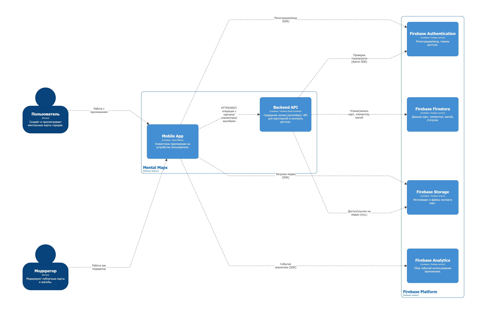
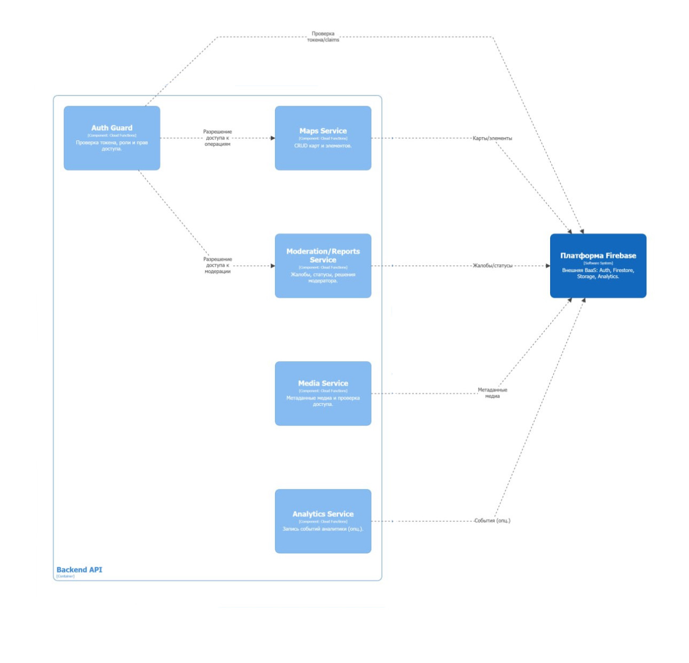
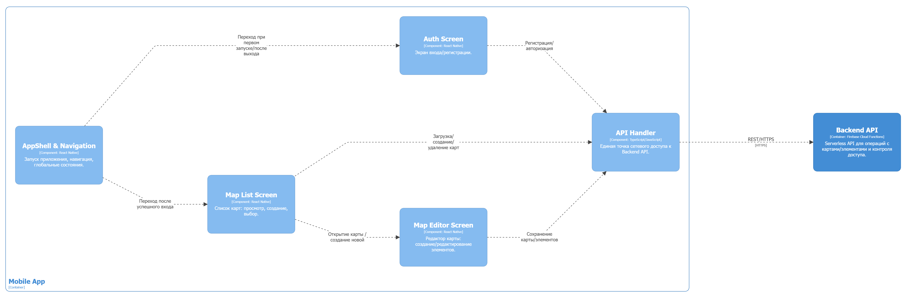

# Лабораторная работа №2  
**Тема:** Использование нотации C4 model для проектирования архитектуры программной системы  
**Проект:** мобильное приложение для рисования ментальных карт города «Mental Maps» 
**Цель работы:** Получить опыт использования графической нотации C4 для фиксации архитектурных решений на примере приложения «Mental Maps».  

---

## 1. Диаграмма системного контекста

- **Пользователь (Person)**  
  Человек, который создаёт и просматривает ментальные карты городов.  
  Взаимодействует с системой только через мобильное приложение «Mental Maps»  
  (стрелка «Создание и просмотр ментальных карт»).

- **Модератор (Person)**  
  Отвечает за модерацию публичных карт и жалоб.  
  Так же работает через мобильное приложение, но с расширенными правами  
  (стрелка «Модерация публичных карт и жалоб»).

- **Мобильное приложение «Mental Maps» (Software System)**  
  Основная система, которую мы проектируем: приложение для создания  
  и редактирования ментальных карт во время путешествий.  
  Принимает запросы от пользователя и модератора и обращается к Firebase  
  за аутентификацией, хранением данных и медиа, аналитикой.

- **Платформа Firebase (Software System)**  
  Внешняя платформа, предоставляющая сервисы Auth, Firestore, Storage, Analytics.  
  Обеспечивает аутентификацию, хранение данных и медиа, сбор аналитики.  
  Связана с приложением «Mental Maps» стрелкой «Аутентификация, данные, медиа, аналитика».

---

## 2. Диаграмма контейнеров

### Основные элементы

- **Пользователь (Person)**  
  Основной актор системы. Использует приложение для создания и просмотра ментальных карт.

- **Модератор (Person)**  
  Актор с расширенными правами. Выполняет модерацию публичного контента и жалоб (работает через то же мобильное приложение).

- **Mobile App (Container, React Native)**  
  Клиентское мобильное приложение на устройстве пользователя.  
  Отвечает за:
  - отображение интерфейса и работу со сценариями пользователя/модератора;
  - формирование запросов к серверной логике (`Backend API`);
  - прямые SDK-вызовы сервисов Firebase там, где это уместно (например, вход через Firebase Auth, загрузка медиа, отправка аналитики).

- **Backend API (Container, Firebase Cloud Functions)**  
  Serverless-контейнер, реализующий прикладную серверную логику.  
  Отвечает за:
  - операции с картами/элементами/жалобами через единый API;
  - централизованный контроль доступа (включая проверки ролей модератора);
  - работу с данными в Firestore и (при необходимости) с медиа в Storage.

- **Firebase Platform (External Software System)** — внешняя интеграция (BaaS), включающая:
  - **Firebase Authentication** — регистрация/вход пользователей, токены доступа;
  - **Firebase Firestore** — хранение данных карт, элементов, жалоб и статусов;
  - **Firebase Storage** — хранение фото/видео и файлов экспорта;
  - **Firebase Analytics** — сбор событий использования приложения.

### Причины выбора базового архитектурного стиля / архитектуры уровня приложений

1. **Клиент–серверная архитектура (mobile client + serverless backend)**  
  Разделение на клиент (Mobile App) и серверную логику (Backend API) даёт понятные границы ответственности: UI/UX и часть прикладной логики на клиенте, контроль доступа и критичные операции — на сервере.

2. **Backend-as-a-Service (BaaS) на Firebase**  
  Firebase закрывает инфраструктурные задачи (аутентификация, база, хранение файлов, аналитика) без разработки и сопровождения собственного серверного стека. Это ускоряет разработку и делает систему масштабируемой.

3. **Гибрид интеграций: SDK на клиенте + Cloud Functions для правил**  
  Там, где можно обойтись прямыми SDK-вызовами (например, Analytics или загрузка файлов), приложение делает это напрямую.  
  Там, где нужна централизованная логика и безопасность (роли модератора, операции над данными), используется `Backend API`.

4. **Масштабируемость и отказоустойчивость**  
   - Firebase автоматически масштабирует хранение и вычисления;  
   - нет необходимости самостоятельно управлять серверами и базами данных;
   - это важно для приложения, рассчитанного на рост числа пользователей и карт.

В сумме такая архитектура даёт баланс между простой реализацией, удобством развития, масштабируемостью и хорошим пользовательским опытом в мобильном приложении.

---

## 3. Диаграмма компонентов backend

### **Backend API (Container, Firebase Cloud Functions)**  
  Точка входа для клиентских запросов, слой прикладной серверной логики.
  
   **Auth Guard (Component)**  
  Компонент входного контроля доступа. Проверяет токен, роль и права пользователя.  
  Разрешает/запрещает выполнение операций сервисами.

- **Maps Service (Component)**  
  Реализует CRUD-операции над картами и элементами: создание/обновление/удаление/чтение.  
  Работает с данными в Firestore.

- **Moderation/Reports Service (Component)**  
  Компонент для модерации: обработка жалоб, изменение статусов, решения модератора.  
  Хранит результаты и состояния в Firestore.

- **Media Service (Component)**  
  Управление метаданными медиа и проверками доступа.  
  Хранит метаданные в Firestore и при необходимости обращается к Storage.

- **Analytics Service (Component, опц.)**  
  Запись событий (например, сохранение карты, действия модерации) при необходимости на серверной стороне.

### **Firebase Platform (External Software System)**  
  Внешняя платформа, предоставляющая сервисы:
  - **Firebase Authentication** — проверка токенов/claims и ролей;
  - **Firebase Firestore** — постоянное хранение данных (карты, элементы, жалобы, статусы);
  - **Firebase Storage** — файлы медиа и экспорт;
  - **Firebase Analytics** — события (опционально).

---

## 4. Диаграмма компонентов frontend

#### Основные элементы:

- **AppShell & Navigation (Component)**  
  «Каркас» приложения: запуск, навигация по экранам, маршрутизация сценариев (переход на авторизацию или в список карт).

- **Auth Screen (Component)**  
  Экран входа/регистрации. Инициирует операции регистрации/авторизации через `API Handler`.

- **Map List Screen (Component)**  
  Экран списка карт: просмотр, создание, выбор карты.  
  Через `API Handler` запрашивает список карт и операции создания/удаления.

- **Map Editor Screen (Component)**  
  Экран редактирования карты: создание и редактирование элементов, сохранение изменений.  
  Через `API Handler` выполняет сохранение карты и элементов.

- **API Handler (Component)**  
  Единая точка сетевого доступа к `Backend API`.  
  Инкапсулирует:
  - формирование HTTPS/REST запросов;
  - обработку ошибок;
  - единый интерфейс для экранов приложения.
