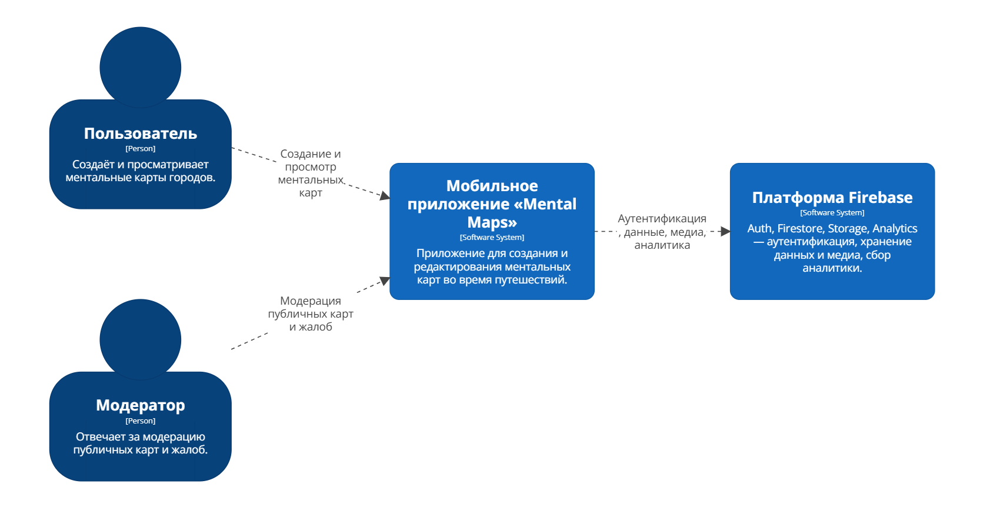
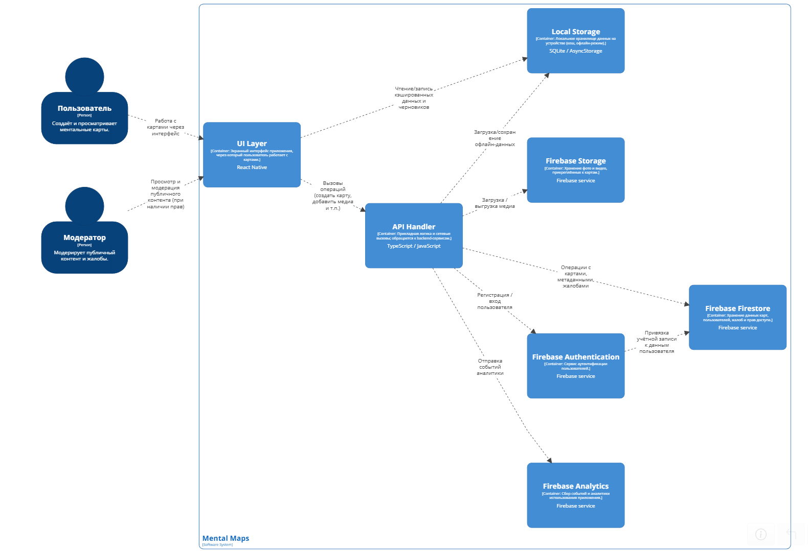
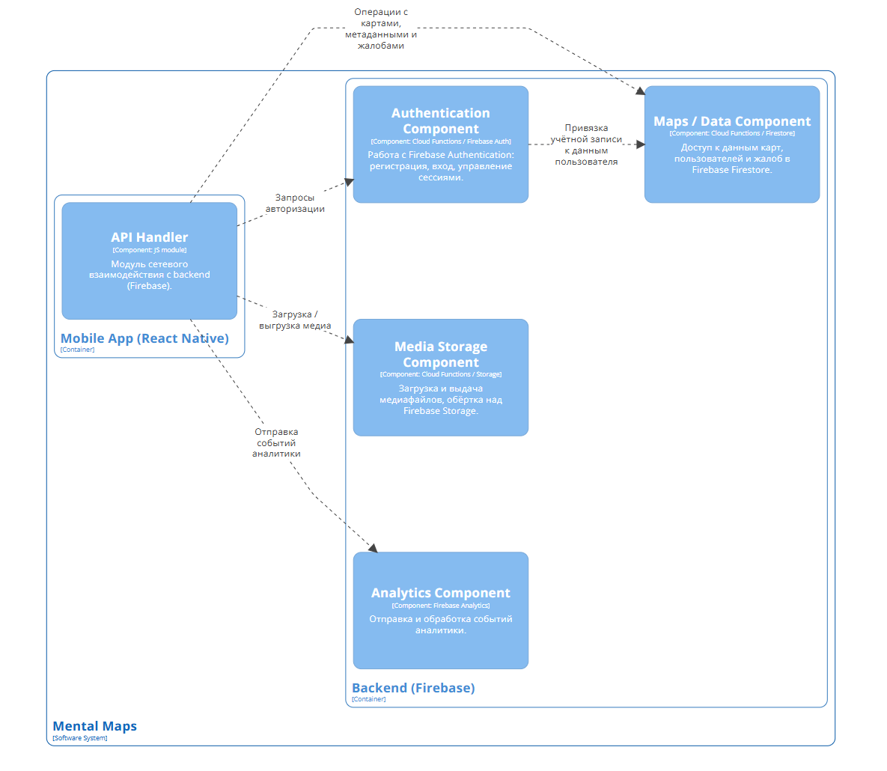
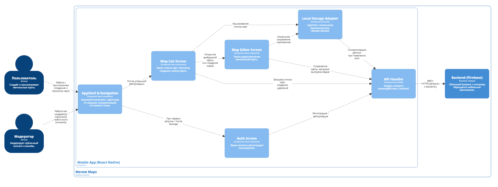

# Лабораторная работа №2  
**Тема:** Использование нотации C4 model для проектирования архитектуры программной системы  
**Проект:** мобильное приложение для рисования ментальных карт города «Mental Maps» 
**Цель работы:** Получить опыт использования графической нотации C4 для фиксации архитектурных решений на примере приложения «Mental Maps».  

---

## 1. Диаграмма системного контекста

- **Пользователь (Person)**  
  Человек, который создаёт и просматривает ментальные карты городов.  
  Взаимодействует с системой только через мобильное приложение «Mental Maps»  
  (стрелка «Создание и просмотр ментальных карт»).

- **Модератор (Person)**  
  Отвечает за модерацию публичных карт и жалоб.  
  Так же работает через мобильное приложение, но с расширенными правами  
  (стрелка «Модерация публичных карт и жалоб»).

- **Мобильное приложение «Mental Maps» (Software System)**  
  Основная система, которую мы проектируем: приложение для создания  
  и редактирования ментальных карт во время путешествий.  
  Принимает запросы от пользователя и модератора и обращается к Firebase  
  за аутентификацией, хранением данных и медиа, аналитикой.

- **Платформа Firebase (Software System)**  
  Внешняя платформа, предоставляющая сервисы Auth, Firestore, Storage, Analytics.  
  Обеспечивает аутентификацию, хранение данных и медиа, сбор аналитики.  
  Связана с приложением «Mental Maps» стрелкой «Аутентификация, данные, медиа, аналитика».

---

## 2. Диаграмма контейнеров

### Основные элементы

- **Пользователь (Person)**  
  Конечный пользователь приложения. Создаёт и просматривает ментальные карты: рисует, добавляет точки интереса, медиа и описания.

- **Модератор (Person)**  
  Пользователь с особыми правами. Просматривает публичный контент и жалобы, может скрывать/блокировать карты, нарушающие правила.

- **UI Layer (Container)**  
  Слой пользовательского интерфейса мобильного приложения (React Native).  
  Отвечает за:
  - отображение экранов;
  - обработку действий пользователя (жесты, нажатия);
  - передачу команд в `API Handler`;
  - отображение данных, полученных из backend или из кеша.

- **API Handler (Container)**  
  Прикладной слой и клиентский API, реализованный на TypeScript/JavaScript.  
  Инкапсулирует всю сетевую работу:
  - формирует запросы к сервисам Firebase;
  - преобразует ответы в удобный формат для UI;
  - координирует синхронизацию локальных данных с сервером.

- **Local Storage (Container)**  
  Локальное хранилище на устройстве (SQLite / AsyncStorage).  
  Используется для:
  - кеширования списка карт и их содержимого;
  - сохранения черновиков и изменений в офлайн-режиме;
  - последующей синхронизации через `API Handler`.

- **Firebase Authentication (Container)**  
  Облачный сервис аутентификации пользователей.  
  Обеспечивает:
  - регистрацию и вход пользователя;
  - управление токенами доступа;
  - базовую безопасность приложений.

- **Firebase Firestore (Container)**  
  NoSQL-хранилище данных.  
  Хранит:
  - структуру и содержимое карт;
  - данные о пользователях;
  - настройки приватности;
  - жалобы и статусы модерации.  
  Связан с Firebase Auth (привязка данных к учётной записи).

- **Firebase Storage (Container)**  
  Объектное хранилище медиафайлов.  
  В нём лежат:
  - фотографии и видео, прикреплённые к точкам/областям карт;
  - экспортированные изображения карт.

- **Firebase Analytics (Container)**  
  Сервис аналитики.  
  Сохраняет события:
  - установка и запуск приложения;
  - создание/редактирование карт;
  - использование ключевых функций.  
  Эти данные используются для последующего анализа поведения пользователей.

### Причины выбора базового архитектурного стиля / архитектуры уровня приложений

1. **Клиент–серверная архитектура с backend-as-a-service (BaaS)**  
   - Мобильное приложение (UI Layer + API Handler + Local Storage) — «толстый» клиент.  
   - Firebase (Auth, Firestore, Storage, Analytics) выступает как готовый облачный backend.  
   - Это снижает затраты на разработку и сопровождение собственного сервера, позволяя сосредоточиться на UX и бизнес-логике приложения.

2. **Слоистая архитектура на стороне клиента**  
   - Разделение на:
     - слой представления (**UI Layer**),
     - слой прикладной логики и сетевого взаимодействия (**API Handler**),
     - слой хранения (**Local Storage**).  
   - Такое разделение облегчает тестирование, замену технологий (например, другого backend’а) и повторное использование кода.

3. **Использование облачных сервисов Firebase**  
   - **Auth** — решает типовые задачи аутентификации (регистрация, вход, сброс пароля), повышая безопасность.  
   - **Firestore** и **Storage** — готовы к масштабированию и обеспечивают надёжное хранение данных и медиа.  
   - **Analytics** — встроенная аналитика без необходимости поднимать отдельную инфраструктуру.  
   - Все сервисы интегрируются между собой и хорошо поддерживаются SDK для React Native.

4. **Масштабируемость и отказоустойчивость**  
   - Firebase автоматически масштабирует хранение и вычисления;  
   - нет необходимости самостоятельно управлять серверами и базами данных;
   - это важно для приложения, рассчитанного на рост числа пользователей и карт.

5. **Поддержка офлайн-режима и слабых сетей**  
   - Наличие отдельного контейнера **Local Storage** позволяет пользователю работать с картами без постоянного подключения к интернету.  
   - `API Handler` отвечает за безопасную и контролируемую синхронизацию с сервером при появлении сети.

В сумме такая архитектура даёт баланс между простой реализацией, удобством развития, масштабируемостью и хорошим пользовательским опытом в мобильном приложении.

---

## 3. Диаграмма компонентов backend

### 1. Mobile App (React Native) — контейнер
Клиентское мобильное приложение, в котором работает пользовательский интерфейс.  
На данной диаграмме из фронта показан только сетевой компонент, взаимодействующий с backend.

- **API Handler (Component, JS module)**  
  Модуль сетевого взаимодействия мобильного приложения с backend (Firebase).  
  Отвечает за:
  - формирование запросов к сервисам аутентификации, данных, медиа и аналитики;
  - обработку ответов и ошибок;
  - единый вход для всех сетевых операций в приложении.

### 2. Backend (Firebase) — контейнер
Облачный backend, реализованный на сервисах Firebase.  
Внутри контейнера выделены несколько компонентов по зонам ответственности.

- **Authentication Component**  
  *[Component: Cloud Functions / Firebase Auth]*  
  Логика работы с Firebase Authentication:
  - регистрация новых пользователей;
  - авторизация/вход;
  - управление сессиями и токенами.

- **Maps / Data Component**  
  *[Component: Cloud Functions / Firestore]*  
  Доступ к данным в Firebase Firestore:
  - хранение структурированных данных ментальных карт;
  - данные о пользователях;
  - хранение жалоб и статусов модерации.

- **Media Storage Component**  
  *[Component: Cloud Functions / Storage]*  
  Обёртка над Firebase Storage:
  - загрузка медиафайлов (фото, видео), прикреплённых к картам;
  - выдача ссылок и доступов для отображения медиа в приложении;
  - при необходимости — очистка неиспользуемых файлов.

- **Analytics Component**  
  *[Component: Firebase Analytics]*  
  Сбор и обработка событий аналитики:
  - фиксация действий пользователя (создание/редактирование карт, входы в приложение и т.д.);
  - передача событий в Firebase Analytics для дальнейшего анализа.

---

## 3. Диаграмма компонентов frontend

#### Основные элементы:

- **Пользователь (Person)**  
  Создаёт и просматривает ментальные карты.  
  Работает с приложением через обычный пользовательский интерфейс
  (стрелка «Работа с приложением» к `AppShell & Navigation`).

- **Модератор (Person)**  
  Модерирует публичный контент и жалобы.  
  Заходит в то же приложение, но с особыми правами
  (стрелка «Работа как модератор» к `AppShell & Navigation`).

- **AppShell & Navigation (Component)**  
  Корневой компонент мобильного приложения.  
  Инициализирует состояние и тему, управляет переходами между экранами:
  при первом запуске/выходе переводит к `Auth Screen`, после авторизации — к `Map List Screen`.

- **Auth Screen (Component)**  
  Экран логина и регистрации пользователя.  
  Отправляет данные для авторизации/регистрации через `API Handler`
  (стрелка «Регистрация / авторизация»).

- **Map List Screen (Component)**  
  Экран списка карт: просмотр, создание и выбор карты.  
  После успешной авторизации открывается из `AppShell`.  
  Обращается к `API Handler` за списком карт и операциями создания/удаления,
  а также к `Local Storage Adapter` для кэширования списка карт.

- **Map Editor Screen (Component)**  
  Экран редактирования ментальной карты.  
  Открывается из `Map List Screen` («Открытие выбранной карты или создание новой»).  
  Сохраняет черновики через `Local Storage Adapter` и передаёт сохранение карты
  и загрузку/выгрузку медиа в `API Handler`.

- **Local Storage Adapter (Component)**  
  Адаптер к локальному хранилищу устройства (кеш, офлайн-режим).  
  Кэширует список карт, хранит локальные черновики и при появлении сети
  синхронизирует данные через `API Handler`.

- **API Handler (Component)**  
  Модуль сетевого взаимодействия с backend.  
  Принимает запросы от экранов (`Auth Screen`, `Map List Screen`, `Map Editor Screen`,
  `Local Storage Adapter`) и отправляет REST/HTTPS-запросы к backend-контейнеру.

- **Backend (Firebase) (Container)**  
  Облачный backend, к которому обращается `API Handler`.  
  На этой диаграмме показан как внешний контейнер-получатель REST/HTTPS-запросов
  от мобильного приложения.
