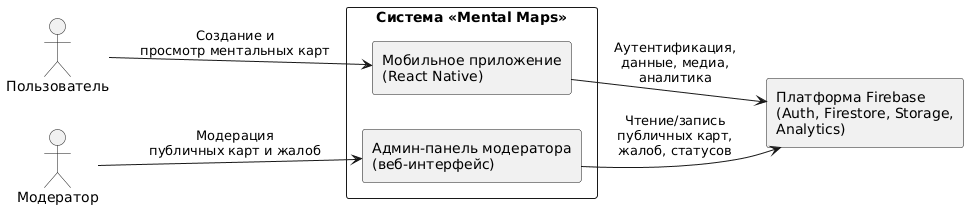
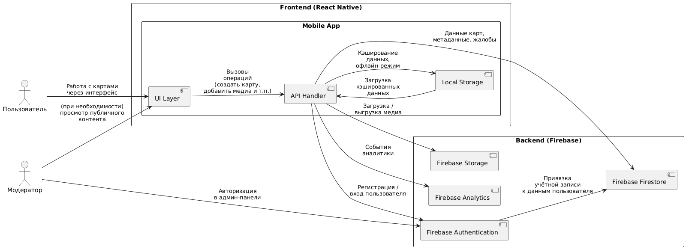
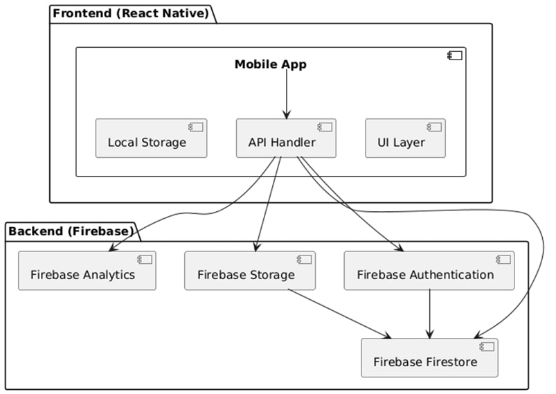
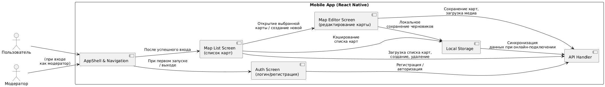

# Лабораторная работа №2  
**Тема:** Использование нотации C4 model для проектирования архитектуры программной системы  
**Проект:** мобильное приложение для рисования ментальных карт города «Mental Maps» 
**Цель работы:** Получить опыт использования графической нотации C4 для фиксации архитектурных решений на примере приложения «Mental Maps».  

---

## 1. Диаграмма системного контекста

**Идея уровня контекста:**  
Показать, кто взаимодействует с системой «Mental Maps» и какие внешние системы она использует.

**Основные элементы:**

- **Люди (Person):**
  - *Путешественник* – основной пользователь, создаёт и редактирует ментальные карты городов.
  - *Модератор* – просматривает публичные карты, обрабатывает жалобы, блокирует некорректный контент.

- **Система:**
  - *Мобильное приложение «Mental Maps»* — основной клиент, через который пользователь выполняет все операции с картами.
  - Админ-панель модератора (web) — интерфейс для работы модератора с жалобами и публичными картами.

- **Внешние системы:**
  - *Платформа Firebase* – аутентификация, хранение данных и медиа, аналитика.  
  - *Почтовый сервис* – отправка писем подтверждения регистрации (через Firebase).
  - *Служба push-уведомлений* – отправка push (Firebase Cloud Messaging / APNs).

---

## 2. Диаграмма контейнеров

### Основные элементы:

#### **Frontend (React Native)**  
Состоит из:

- **Mobile App**
  - **UI Layer** — экраны и визуальные компоненты.
  - **API Handler** — отвечает за сетевое взаимодействие.
  - **Local Storage** — локальный кеш данных и офлайн-режим.

#### **Backend (Firebase)**  
Включает:

- **Firebase Authentication** — регистрация, вход, управление сессией пользователя.  
- **Firebase Firestore** — база данных для хранения карт, пользователей, жалоб, прав доступа.  
- **Firebase Storage** — хранилище медиа (фото/видео).  
- **Firebase Analytics** — сбор данных об использовании приложения.

**Причины выбора архитектурного стиля:**

- Применён стиль **клиент–сервер**, где мобильное приложение — клиент, а Firebase — backend-as-a-service.
- Такой стиль выбрали потому что:
  - Firebase снимает необходимость самостоятельно разворачивать backend, базу данных и хранилище.
  - Упрощается масштабирование и обслуживание.
  - React Native позволяет быстро разрабатывать приложение сразу для Android и iOS.
  - Архитектура становится модульной: UI, логика, хранение, сеть — каждый компонент независим.
  - Backend полностью управляем облаком и не требует ручной поддержки.

Архитектура контейнеров обеспечивает высокую масштабируемость, удобство разработки и надёжность.

---

## 3. Диаграмма компонентов

Ниже описаны две диаграммы: основная и детализированная.

### 3.1. Основная диаграмма компонентов

В этой диаграмме отражено взаимодействие между ключевыми компонентами мобильного приложения и Firebase.

#### Основные элементы:

- **UI Layer** — принимает действия пользователя и передаёт их API Handler’у.
- **API Handler** — центральный модуль сетевого взаимодействия:
  - работает с Firebase Authentication;
  - отправляет и получает данные из Firestore;
  - сохраняет и загружает медиа в Firebase Storage;
  - отправляет события в Firebase Analytics.
- **Local Storage** — компонент кэширования данных и офлайн-работы.

На стороне backend показаны 4 основных сервиса Firebase, каждый со своей ролью:
- Auth — проверка пользователей.
- Firestore — хранение карт.
- Storage — медиа-файлы.
- Analytics — сбор телеметрии.

---

### 3.2. Детализированная диаграмма компонентов Mobile App

Здесь приложение раскрыто глубже, с акцентом на пользовательские экраны и их взаимодействие с инфраструктурными частями.

#### Основные элементы:

- **AppShell & Navigation**  
  Управляет навигацией между экранами и глобальным состоянием.

- **Auth Screen**  
  Выполняет вход/регистрацию через API Handler.

- **Map List Screen**  
  Показывает пользователю список карт, опираясь на Firestore (через API Handler) и Local Storage (кэш).

- **Map Editor Screen**  
  Позволяет пользователю редактировать карту: рисовать, добавлять описания и медиа.

- **API Handler**  
  Единая точка доступа ко всем сервисам Firebase.

- **Local Storage**  
  Сохраняет офлайн-данные и черновики карт.
