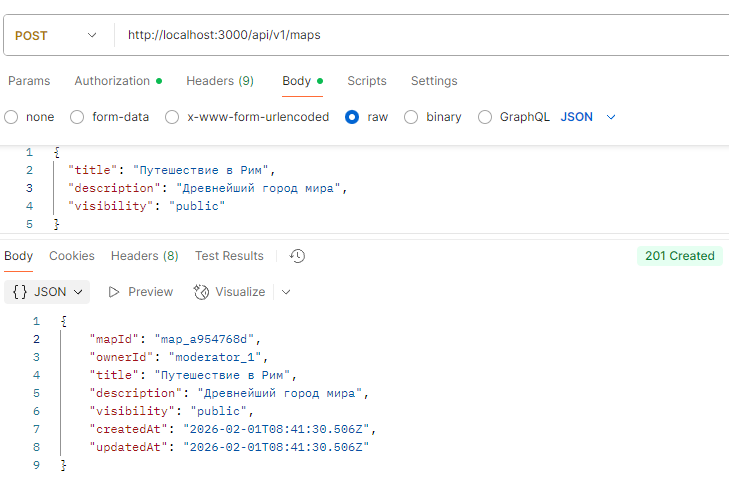
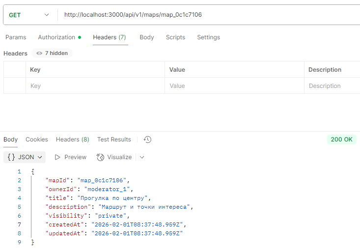
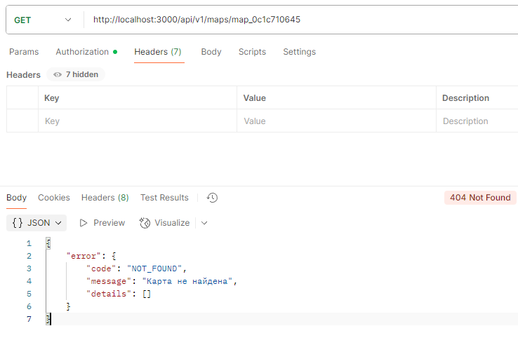
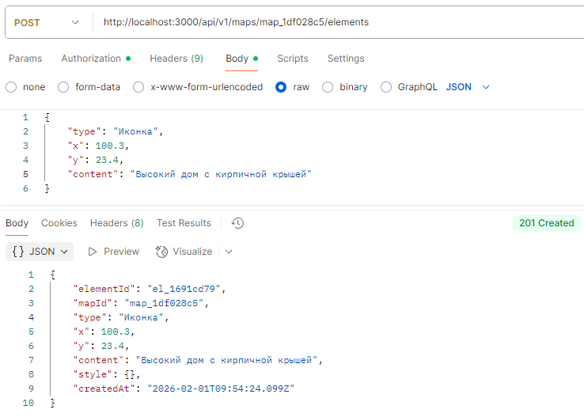
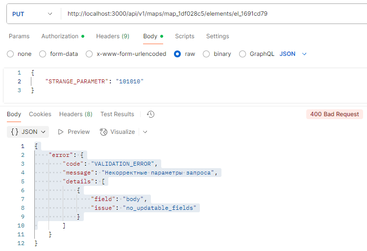
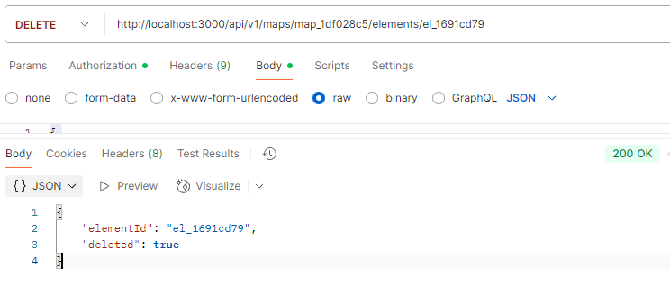
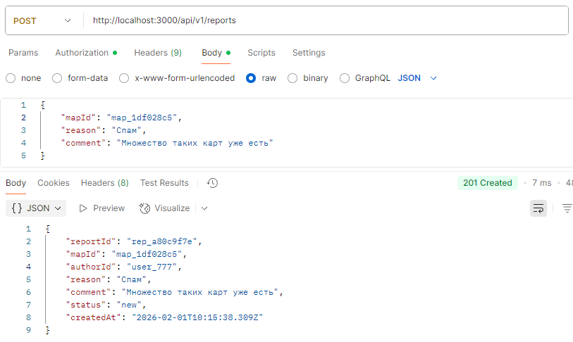
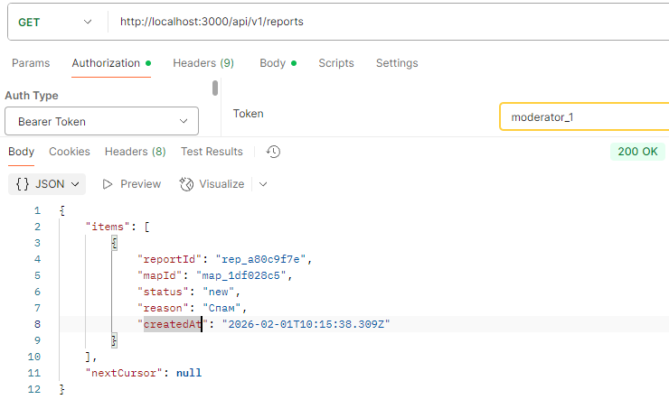
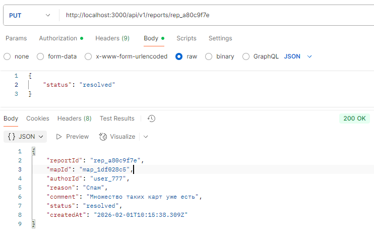
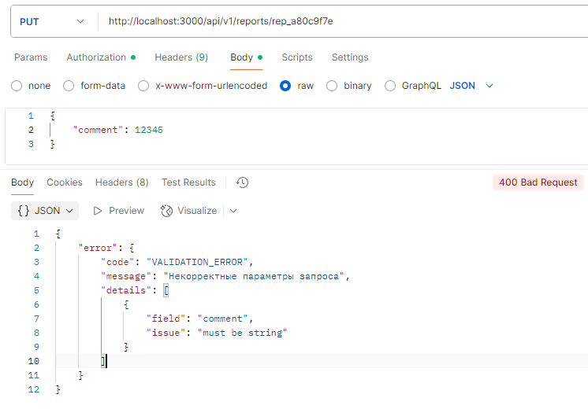

# Лабораторная работа №4  
**Тема:** Проектирование REST API  
**Проект:** мобильное приложение для ментальных карт «Mental Maps»  
**Выбранный сервис системы, предоставляющий API:** **Backend API → Maps & Moderation Service** (serverless слой на Firebase Cloud Functions)

## Цель работы
Получить опыт проектирования программного интерфейса: определить проектные решения, описать REST API (GET/POST/PUT/DELETE), подготовить основу для реализации и тестирования (Postman).

---

## 1. Описание выбранного сервиса
### Зачем нужен Backend API в «Mental Maps»
Хотя Firebase предоставляет готовые сервисы (Auth/Firestore/Storage/Analytics), **Backend API** нужен для:
- централизованной **проверки прав доступа** (особенно для роли модератора);
- единообразной валидации данных и форматов;
- реализации бизнес-операций (создание/обновление карт, работа с жалобами и статусами);
- уменьшения “разрастания” логики на клиенте.

### Роли и доступ
- **Пользователь**: работает только со своими картами, может отправлять жалобы.
- **Модератор**: дополнительно может просматривать жалобы и менять статусы модерации.

---

## 2. Принятые проектные решения

1. **Ресурсный подход (REST):**  
   API проектируется вокруг ресурсов: `maps`, `elements`, `routes`, `reports` (жалобы), а не вокруг действий.  

2. **Версионирование по URL:**  
   Все маршруты имеют префикс: `/api/v1/...` — это упрощает дальнейшее развитие без ломания клиентов.

3. **Аутентификация через Bearer Token (Firebase ID token):**  
   Клиент передаёт `Authorization: Bearer <idToken>`. Backend проверяет токен через Firebase Admin SDK.

4. **Авторизация по ролям и владению (RBAC + ownership):**  
   - Пользователь может изменять только свои ресурсы.  
   - Модератор может управлять модерацией/жалобами.  
   Роль определяется через claims (например, `role=moderator`) или отдельное поле профиля.

5. **Единый формат обмена JSON:**  
   Ошибки возвращаются в стандартизированном JSON, чтобы клиент мог одинаково обрабатывать любые сбои.

6. **Использование стандартных HTTP-методов:**
   - `GET` — получение,
   - `POST` — создание,
   - `PUT` — полное обновление/замена,
   - `DELETE` — удаление.

7. **Идемпотентность `PUT` и `DELETE`:**  
   Повторный `PUT` с тем же телом должен приводить к тому же состоянию ресурса, `DELETE` повторно возвращает `204` или `404` (выбран единый вариант, см. ниже).

8. **Пагинация списков через `limit` + `cursor`:**  
   Для больших списков (например, карты пользователя) используются параметры `limit` и `cursor` (курсорная пагинация лучше подходит для NoSQL).

9. **Согласованный нейминг и структура данных:**  
   - идентификаторы: `mapId`, `elementId`, `reportId`;  
   - поля — `snake_case` внутри БД, но в API — `camelCase` (или наоборот).  
   В данном API фиксируем **camelCase** в запросах/ответах.

10. **Явная поддержка публичности карт:**  
   Карта может быть `visibility: "private" | "public"`. Публичные карты видимы всем, но изменяемы только владельцем/модератором (по правилам).
---

# Документация по API

**Базовые параметры**
*   **Base URL:** `http://localhost:3000/api/v1` 
*   **Формат данных:** `application/json`
*   **Заголовки:** `Bearer <idToken>` (для защищённых запросов)

## 1) Архитектура и устройство API

### 1.1 Общая схема компонентов
- **HTTP-клиент** (Postman / Mobile App) отправляет запросы на API.
- **Express-приложение** принимает запросы и маршрутизирует их по роутерам:
  - `Maps Router` — работа с картами и элементами карты  
  - `Reports Router` — жалобы и действия модератора
- **Middleware авторизации** (`requireAuth`, `requireModerator`) проверяет заголовок `Authorization` и роль.
- **Хранилище данных**: **in-memory** (`memoryStore`), данные сбрасываются при перезапуске сервера.
- **Единый обработчик ошибок** формирует согласованный JSON-ответ при ошибках.

### 1.2 Модули и зона ответственности (маппинг “что к чему относится”)
| Функциональность | HTTP пути | Где реализовано |
|---|---|---|
| Карты (`maps`) | `/maps`, `/maps/{mapId}` | `routes/maps.js` |
| Элементы карты (`elements`) | `/maps/{mapId}/elements`, `/maps/{mapId}/elements/{elementId}` | `routes/maps.js` |
| Жалобы (`reports`) | `/reports`, `/reports/{reportId}` | `routes/reports.js` |
| Авторизация/роли | заголовок `Authorization` | `middleware/auth.js` |
| Ошибки в одном формате | `errorHandler` | `utils/errors.js` |
| Данные | `store.maps`, `store.elements`, `store.reports` | `store/memoryStore.js` |

### 1.3 Роли и доступ
API поддерживает 2 роли:
- **user** — обычный пользователь
- **moderator** — модератор

Правила доступа (общая логика):
- **Private-ресурсы** доступны владельцу (owner) и модератору.
- **Public-ресурсы** доступны любому авторизованному пользователю (на чтение).
- Любое изменение/удаление карты/элементов — только **owner или moderator**.

### 1.4 Токены
- Пользователь: `Authorization: Bearer user_777`
- Модератор: `Authorization: Bearer moderator_1`
---

## 2) Общие соглашения API

### 2.1 Формат данных
- Запросы/ответы — JSON (`Content-Type: application/json`) для `POST/PUT`.
- Даты — ISO 8601 (`2026-02-01T10:00:00Z`).

### 2.2 Пагинация (списки)
В списковых запросах используется:
- `limit` — размер страницы (по умолчанию 20, максимум 50)
- `cursor` — смещение (offset), целое число строкой

Ответ:
- `items` — массив элементов
- `nextCursor` — строка или `null`

### 2.3 Типовые статусы
- `200 OK` — успешный запрос (GET/PUT)
- `201 Created` — успешное создание (POST)
- `204 No Content` — успешное удаление (DELETE)
- `400 Bad Request` — ошибка валидации/параметров
- `401 Unauthorized` — нет/неверный токен
- `403 Forbidden` — нет прав (роль/владелец)
- `404 Not Found` — ресурс не найден
- `409 Conflict` — конфликт состояния (например, попытка создать дубликат)
- `500 Internal Server Error` — непредвиденная ошибка
---

## 3) Модели данных (объекты ответа)

### 3.1 Map (Карта)
```json
{
  "mapId": "map_1a2b3c4d",
  "ownerId": "user_777",
  "title": "Прогулка по центру",
  "description": "Маршрут и точки интереса",
  "visibility": "private",
  "createdAt": "2026-02-01T10:00:00Z",
  "updatedAt": "2026-02-01T10:00:00Z"
}
```

### 3.2 Element (Элемент карты)
```json
{
  "elementId": "el_9f8e7d6c",
  "mapId": "map_1a2b3c4d",
  "type": "point",
  "x": 55.751244,
  "y": 37.618423,
  "content": "Красная площадь",
  "style": { "color": "#FFAA00", "size": 12 },
  "createdAt": "2026-02-01T10:05:00Z"
}
```

### 3.3 Report (Жалоба)
```json
{
  "reportId": "rep_0a1b2c3d",
  "mapId": "map_1a2b3c4d",
  "authorId": "user_777",
  "reason": "Неприемлемый контент",
  "comment": "Описание проблемы",
  "status": "new",
  "createdAt": "2026-02-01T10:20:00Z"
}
```

---

# 4) Документация по API (Endpoints)

## 4.1 Healthcheck

### GET `/health`
Проверка доступности сервиса.

**Auth:** не требуется  
**Response `200`:**
```json
{ "status": "ok", "service": "mental-maps-api", "version": "v1" }
```

---

## 4.2 Maps API

### POST `/maps`
Создать новую карту.

**Auth:** требуется (`user` / `moderator`)  
**Headers:**
- `Authorization: Bearer <token>`
- `Content-Type: application/json`

**Body:**
- `title` *(string, required, non-empty)*
- `description` *(string, optional, default: "")*
- `visibility` *(string, optional, `"private"` или `"public"`, default: `"private"`)*

**Пример запроса:**
```json
{
  "title": "Прогулка по центру",
  "description": "Маршрут и точки интереса",
  "visibility": "private"
}
```

**Response `201 Created`:** объект `Map`.

**Ошибки:**
- `400 VALIDATION_ERROR` — нет `title` / неверный `visibility`
- `401 UNAUTHORIZED` — нет токена

---

### GET `/maps`
Получить список карт текущего пользователя.

**Auth:** требуется  
**Query params (optional):**
- `limit` *(1..50)*
- `cursor` *(offset, >=0)*
- `visibility` *(private|public)*

**Response `200`:**
```json
{
  "items": [
    {
      "mapId": "map_1a2b3c4d",
      "title": "Прогулка по центру",
      "visibility": "private",
      "updatedAt": "2026-02-01T10:00:00Z"
    }
  ],
  "nextCursor": "20"
}
```

**Ошибки:**
- `401 UNAUTHORIZED`

---

### GET `/maps/{mapId}`
Получить карту по идентификатору.

**Auth:** требуется  
**Access rules:**
- если `visibility="public"` → доступно любому авторизованному
- если `visibility="private"` → только **owner** или **moderator**

**Path params:**
- `mapId` *(string)*

**Response `200`:** объект `Map`

**Ошибки:**
- `401 UNAUTHORIZED`
- `403 FORBIDDEN` — private-карта не ваша и вы не модератор
- `404 NOT_FOUND` — карты нет

---

### PUT `/maps/{mapId}`
Обновить карту (частичное обновление полей в теле запроса).

**Auth:** требуется  
**Доступ:** owner или moderator  
**Headers:** `Authorization`, `Content-Type: application/json`

**Body:** можно передать **любую комбинацию** из полей:
- `title` *(string, non-empty)*
- `description` *(string)*
- `visibility` *(private|public)*

**Response `200`:** обновлённый объект `Map` (с новым `updatedAt`)

**Ошибки:**
- `400 VALIDATION_ERROR` — некорректные поля / пустое тело без апдейтов
- `403 FORBIDDEN` — нет прав
- `404 NOT_FOUND` — карты нет

---

### DELETE `/maps/{mapId}`
Удалить карту.

**Auth:** требуется  
**Доступ:** owner или moderator  

**Response `200`:**
```json
{ "mapId": "map_1a2b3c4d", "deleted": true }
```

**Доп. поведение (важно для архитектуры данных):**
- вместе с картой удаляются:
  - все элементы этой карты
  - все жалобы (`reports`) по этой карте (и запись из индекса пагинации жалоб)

**Ошибки:**
- `403 FORBIDDEN`
- `404 NOT_FOUND`

---

## 4.3 Elements API (элементы карты)

### POST `/maps/{mapId}/elements`
Добавить элемент в карту.

**Auth:** требуется  
**Доступ:** owner или moderator  
**Headers:** `Authorization`, `Content-Type: application/json`

**Body (required fields):**
- `type` *(string, required)*
- `x` *(number, required)*
- `y` *(number, required)*
- `content` *(string, optional)*
- `style` *(object, optional)*

**Response `201`:** объект `Element`

**Ошибки:**
- `400 VALIDATION_ERROR` — неверные типы (`x/y` должны быть number, `type` обязателен)
- `403 FORBIDDEN` — нет прав
- `404 NOT_FOUND` — карты нет

---

### GET `/maps/{mapId}/elements`
Получить список элементов карты.

**Auth:** требуется  
**Доступ:** как для чтения карты (public — любому авторизованному, private — owner/moderator)

**Response `200`:**
```json
{
  "items": [
    { "elementId": "el_9f8e7d6c", "type": "point", "x": 55.75, "y": 37.61, "content": "..." }
  ]
}
```

**Ошибки:**
- `403 FORBIDDEN`
- `404 NOT_FOUND` — карты нет

---

### PUT `/maps/{mapId}/elements/{elementId}`
Обновить элемент (частичное обновление).

**Auth:** требуется  
**Доступ:** owner или moderator  
**Headers:** `Authorization`, `Content-Type: application/json`

**Body:** можно передать любую комбинацию:
- `type` *(string, non-empty)*
- `x` *(number)*
- `y` *(number)*
- `content` *(string)*
- `style` *(object)*

**Response `200`:** обновлённый объект `Element`

**Ошибки:**
- `404 NOT_FOUND` — карта или элемент не найден
- `403 FORBIDDEN` — нет прав
- `400 VALIDATION_ERROR` — некорректные типы

---

### DELETE `/maps/{mapId}/elements/{elementId}`
Удалить элемент карты.

**Auth:** требуется  
**Доступ:** owner или moderator  

**Response `200`:**
```json
{ "elementId": "el_9f8e7d6c", "deleted": true }
```

**Ошибки:**
- `404 NOT_FOUND` — карта/элемент не найден
- `403 FORBIDDEN`

---

## 4.4 Reports API (жалобы и модерация)

> Реализация — в `routes/reports.js`.

### POST `/reports`
Создать жалобу на карту.

**Auth:** требуется  
**Headers:** `Authorization`, `Content-Type: application/json`

**Body:**
- `mapId` *(string, required)*
- `reason` *(string, required, non-empty)*
- `comment` *(string, optional)*

**Response `201`:** объект `Report` (status всегда `"new"`)

**Ошибки:**
- `400 VALIDATION_ERROR` — нет mapId/reason
- `404 NOT_FOUND` — карта не найдена (жалоба не создаётся)

---

### GET `/reports`
Список жалоб (доступно только модератору).

**Auth:** требуется  
**Role:** moderator  
**Query params (optional):**
- `status` *(new|in_progress|resolved|rejected)*
- `limit` *(1..50)*
- `cursor` *(offset >= 0)*

**Response `200`:**
```json
{
  "items": [
    {
      "reportId": "rep_0a1b2c3d",
      "mapId": "map_1a2b3c4d",
      "status": "new",
      "reason": "Неприемлемый контент",
      "createdAt": "2026-02-01T10:20:00Z"
    }
  ],
  "nextCursor": null
}
```

**Ошибки:**
- `403 FORBIDDEN` — если роль не moderator
- `401 UNAUTHORIZED` — без авторизации

---

### PUT `/reports/{reportId}`
Обновить жалобу (модератор): изменить `status` и/или `comment`.

**Auth:** требуется  
**Role:** moderator  
**Headers:** `Authorization`, `Content-Type: application/json`

**Body:** можно передать:
- `status` *(new|in_progress|resolved|rejected)*
- `comment` *(string)*

> Если не передано ни `status`, ни `comment` → `400 VALIDATION_ERROR`.

**Response `200`:** обновлённый `Report`

**Ошибки:**
- `404 NOT_FOUND` — жалоба не найдена
- `400 VALIDATION_ERROR` — неверный статус/тип comment

---

### DELETE `/reports/{reportId}`
Удалить жалобу (модератор).

**Auth:** требуется  
**Role:** moderator  

**Response `200`:**
```json
{ "reportId": "rep_0a1b2c3d", "deleted": true }
```

**Ошибки:**
- `404 NOT_FOUND`
- `403 FORBIDDEN`

---


# Тестирование API

## 1.Maps API

### Создать карту. Тест 1
**Endpoint:** POST http://localhost:3000/api/v1/map`  
**Auth:** Bearer token moderator_1
#### Request Body
```json
{
  "title": "Прогулка по центру",
  "description": "Маршрут и точки интереса",
  "visibility": "private"
}
```

#### Response `201 Created`
```json
{
   "mapId": "map_0c1c7106",
    "ownerId": "moderator_1",
    "title": "Прогулка по центру",
    "description": "Маршрут и точки интереса",
    "visibility": "private",
    "createdAt": "2026-02-01T08:37:48.959Z",
    "updatedAt": "2026-02-01T08:37:48.959Z"
}
```


### Создать карту. Тест 2
**Endpoint:** POST http://localhost:3000/api/v1/map`  
**Auth:** Bearer moderator_1

#### Request Body
```json
{
    "title": "Путешествие в Рим",
  "description": "Древнейший город мира",
  "visibility": "public"
}
```

#### Response `201 Created`
```json
{
   "mapId": "map_a954768d",
    "ownerId": "moderator_1",
    "title": "Путешествие в Рим",
    "description": "Древнейший город мира",
    "visibility": "public",
    "createdAt": "2026-02-01T08:41:30.506Z",
    "updatedAt": "2026-02-01T08:41:30.506Z"
}
```

---

### Получить список карт пользователя
**Endpoint:** `GET http://localhost:3000/api/v1/maps
**Auth:** Bearer token moderator_1

#### Response `200 OK`
```json
 {
    "items": [
        {
            "mapId": "map_a954768d",
            "title": "Путешествие в Рим",
            "visibility": "public",
            "updatedAt": "2026-02-01T08:41:30.506Z"
        },
        {
            "mapId": "map_0c1c7106",
            "title": "Прогулка по центру",
            "visibility": "private",
            "updatedAt": "2026-02-01T08:37:48.959Z"
        }
    ],
    "nextCursor": null
}
```

---

### Получить список карт пользователя без авторизации 
**Endpoint:** `GET http://localhost:3000/api/v1/maps`  
**Auth:** No AUTH

#### Response `401 Unauthorized`
```json
{
    "error": {
        "code": "UNAUTHORIZED",
        "message": "Отсутствует или неверный токен авторизации",
        "details": []
    }
}
```

---

### Получить карту по id
**Endpoint:** `GET http://localhost:3000/api/v1/maps/map_0c1c7106`  
**Auth:** Bearer token moderator_1

#### Response `200 ОК`
```json
{
    "mapId": "map_0c1c7106",
    "ownerId": "moderator_1",
    "title": "Прогулка по центру",
    "description": "Маршрут и точки интереса",
    "visibility": "private",
    "createdAt": "2026-02-01T08:37:48.959Z",
    "updatedAt": "2026-02-01T08:37:48.959Z"
}
```

---

### Получить карту по неверному id
**Endpoint:** `GET http://localhost:3000/api/v1/maps/map_0c1c710645`  
**Auth:** Bearer token moderator_1

#### Response `404 Not Found`
```json
 {
    "error": {
        "code": "NOT_FOUND",
        "message": "Карта не найдена",
        "details": []
    }
}
```

---

### Обновить карту по id. Тест 1
**Endpoint:** `PUT http://localhost:3000/api/v1/maps/map_1df028c5`  
**Auth:**  Bearer token moderator_1

#### Request Body
```json
{
   "title": "Лучшая прогулка по центру"
}
```

#### Response `200 OK`
```json
 {
    "mapId": "map_1df028c5",
    "ownerId": "moderator_1",
    "title": "Лучшая прогулка по центру",
    "description": "Маршрут и точки интереса",
    "visibility": "private",
    "createdAt": "2026-02-01T09:29:15.765Z",
    "updatedAt": "2026-02-01T09:31:08.568Z"
}
```

---

### Обновить карту по id. Тест 2
**Endpoint:** `PUT http://localhost:3000/api/v1/maps/map_map_dbcb04b`  
**Auth:**  Bearer token moderator_1

#### Request Body
```json
{
   "visibility": "private"
}
```

#### Response `200 OK`
```json
 {
    "mapId": "map_dbcb04bd",
    "ownerId": "moderator_1",
    "title": "Путешествие в Рим",
    "description": "Древнейший город мира",
    "visibility": "private",
    "createdAt": "2026-02-01T09:29:46.275Z",
    "updatedAt": "2026-02-01T09:32:54.484Z"
}
```

---

### Удалить карту 
**Endpoint:** `DELETE http://localhost:3000/api/v1/maps/map_dbcb04bd`  
**Auth:**  Bearer token moderator_1

#### Response `200 OK`
```json
  {
    "mapId": "map_dbcb04bd",
    "deleted": true
}
```

---

### Удалить несуществующую карту 
**Endpoint:** `DELETE http://localhost:3000/api/v1/maps/map_dbcb04bd`  
**Auth:**  Bearer token moderator_1

#### Response `404 Not Found`
```json
   {
    "error": {
        "code": "NOT_FOUND",
        "message": "Карта не найдена",
        "details": []
    }
}
```

---

## 2. Elements API (элементы карты)

### Добавить элемент на карту
**Endpoint:** ` POST http://localhost:3000/api/v1/maps/map_1df028c5/elements`  
**Auth:**  Bearer token moderator_1

#### Request Body
```json
{
    "type": "Иконка",
    "x": 100.3,
    "y": 23.4,
    "content": "Высокий дом с кирпичной крышей"
} 
```

#### Response `201 Created`
```json
 {
    "elementId": "el_1691cd79",
    "mapId": "map_1df028c5",
    "type": "Иконка",
    "x": 100.3,
    "y": 23.4,
    "content": "Высокий дом с кирпичной крышей",
    "style": {},
    "createdAt": "2026-02-01T09:54:24.099Z"
}
```

---

### Добавить элемент на карту другого пользователя
**Endpoint:** `POST http://localhost:3000/api/v1/maps/map_1df028c5/elements`  
**Auth:**  Bearer token user_777

#### Request Body
```json
 {
    "type": "Иконка",
    "x": 100.3,
    "y": 23.4,
    "content": "Высокий дом с кирпичной крышей"
} 
```

#### Response `403 Forbidden`
```json
  {
    "error": {
        "code": "FORBIDDEN",
        "message": "Недостаточно прав для изменения карты",
        "details": []
    }
}
```

---

### Получить элементы карты
**Endpoint:** `GET http://localhost:3000/api/v1/maps/map_1df028c5/elements`  
**Auth:**  Bearer token moderator_1

#### Response `200 OK`
```json
{
    "items": [
        {
            "elementId": "el_1691cd79",
            "type": "Иконка",
            "x": 100.3,
            "y": 23.4,
            "content": "Высокий дом с кирпичной крышей"
        },
        {
            "elementId": "el_55adbc7d",
            "type": "Кнопка",
            "x": 50.3,
            "y": 27.4,
            "content": "Магазин"
        }
    ]
}
```

---

### Получить элементы несуществующей карты
**Endpoint:** `GET http://localhost:3000/api/v1/maps/map_1df028c51/elements`  
**Auth:**  Bearer token moderator_1

#### Response `404 Not Found`
```json
{
    "error": {
        "code": "NOT_FOUND",
        "message": "Карта не найдена",
        "details": []
    }
}
```

---

### Обновить элемент
**Endpoint:** ` PUT http://localhost:3000/api/v1/maps/map_1df028c5/elements/el_1691cd79`  
**Auth:**  Bearer token moderator_1

#### Request Body
```json
 {
    "content": "Старинный дом с кирпичной крышей"
}
```

#### Response `200 OK`
```json
 {
    "elementId": "el_1691cd79",
    "mapId": "map_1df028c5",
    "type": "Иконка",
    "x": 100.3,
    "y": 23.4,
    "content": "Старинный дом с кирпичной крышей",
    "style": {},
    "createdAt": "2026-02-01T09:54:24.099Z"
}
```

---

### Обновить элемент (параметр), которого не существует
**Endpoint:** ` PUT http://localhost:3000/api/v1/maps/map_1df028c5/elements/el_1691cd79`  
**Auth:**  Bearer token moderator_1

#### Request Body
```json
 {
    "STRANGE_PARAMETR": "101010"
}
```

#### Response `200 OK`
```json
{
    "error": {
        "code": "VALIDATION_ERROR",
        "message": "Некорректные параметры запроса",
        "details": [
            {
                "field": "body",
                "issue": "no_updatable_fields"
            }
        ]
    }
}
```

---

### Удалить элемент
**Endpoint:** : `DELETE http://localhost:3000/api/v1/maps/map_1df028c5/elements/el_1691cd79`  
**Auth:**  Bearer token moderator_1

#### Response `200 ОК`
```json
 {
    "elementId": "el_1691cd79",
    "deleted": true
}
```

---

### Удалить несуществующий элемент
**Endpoint:** : `DELETE http://localhost:3000/api/v1/maps/map_1df028c5/elements/el_1691cd79`  
**Auth:**  Bearer token moderator_1

#### Response `404 Not Found`
```json
 {
    "error": {
        "code": "NOT_FOUND",
        "message": "Элемент не найден",
        "details": []
    }
}
```

---

## 3. Reports API (жалобы и модерация)

### Создать жалобу
**Endpoint:** `POST http://localhost:3000/api/v1/reports `  
**Auth:** Bearer token moderator_1

#### Request Body
```json
{
    "mapId": "map_1df028c5",
    "reason": "Спам",
    "comment": "Множество таких карт уже есть"
}
```

#### Response `201 Created`
```json
 {
    "reportId": "rep_a80c9f7e",
    "mapId": "map_1df028c5",
    "authorId": "user_777",
    "reason": "Спам",
    "comment": "Множество таких карт уже есть",
    "status": "new",
    "createdAt": "2026-02-01T10:15:38.309Z"
}
```

---

### Создать жалобу с пустым body
**Endpoint:** `POST http://localhost:3000/api/v1/reports `  
**Auth:** Bearer token moderator_1

#### Request Body
```json
{

}
```

#### Response `400 Bad Request`
```json
 {
    "error": {
        "code": "VALIDATION_ERROR",
        "message": "Некорректные параметры запроса",
        "details": [
            {
                "field": "mapId",
                "issue": "required"
            },
            {
                "field": "reason",
                "issue": "required"
            }
        ]
    }
}
```

---

### Получить список жалоб (модератор)
**Endpoint:** `GET http://localhost:3000/api/v1/reports`  
**Auth:** Bearer token moderator_1

#### Response `200 OK`
```json
{
    "items": [
        {
            "reportId": "rep_a80c9f7e",
            "mapId": "map_1df028c5",
            "status": "new",
            "reason": "Спам",
            "createdAt": "2026-02-01T10:15:38.309Z"
        }
    ],
    "nextCursor": null
}
```

---

### Получить список жалоб (не модератор)
**Endpoint:** `GET http://localhost:3000/api/v1/reports`  
**Auth:** Bearer token user_777
#### Response `403 Forbidden`
```json
{
    "error": {
        "code": "FORBIDDEN",
        "message": "Недостаточно прав: требуется роль модератора",
        "details": []
    }
}
```

---

### Изменить статус жалобы (модератор) 
**Endpoint:** `PUT http://localhost:3000/api/v1/reports/rep_a80c9f7e`  
**Auth:** Bearer token moderator_1

#### Request Body
```json
{
    "status": "resolved"
}
```

#### Response `200 OK`
```json
 {
    "reportId": "rep_a80c9f7e",
    "mapId": "map_1df028c5",
    "authorId": "user_777",
    "reason": "Спам",
    "comment": "Множество таких карт уже есть",
    "status": "resolved",
    "createdAt": "2026-02-01T10:15:38.309Z"
}
```

---

### Изменить статус жалобы с неправильным форматом данных
**Endpoint:** `PUT http://localhost:3000/api/v1/reports/rep_a80c9f7e`  
**Auth:** Bearer token moderator_1

#### Request Body
```json
{
   "comment": 12345 //Комментарий не строка
}
```

#### Response `400 Bad Request`
```json
{
    "error": {
        "code": "VALIDATION_ERROR",
        "message": "Некорректные параметры запроса",
        "details": [
            {
                "field": "comment",
                "issue": "must be string"
            }
        ]
    }
}
```

---

### Удалить жалобу
**Endpoint:** : `DELETE  http://localhost:3000/api/v1/reports/rep_a80c9f7e`  
**Auth:**  Bearer token moderator_1

#### Response `200 ОК`
```json
 {
    "reportId": "rep_a80c9f7e",
    "deleted": true
}
```

---

### Удалить несуществующую  жалобу
**Endpoint:** : `DELETE http://localhost:3000/api/v1/reports/rep_a80c9f7e34`  
**Auth:**  Bearer token moderator_1

#### Response `404 Not Found `
```json
 {
    "error": {
        "code": "NOT_FOUND",
        "message": "Жалоба не найдена",
        "details": []
    }
}
```

---
