# Лабораторная работа №6  
**Тема:** Использование шаблонов проектирования <br>
**Проект:** *Mental Maps*  
**Цель работы:** Получить опыт применения шаблонов проектирования при написании кода программной системы.

## I. Порождающие шаблоны

### 1. Singleton

**Название:** Singleton (Одиночка)

**Общее назначение:**  
Шаблон Singleton гарантирует, что у класса существует только один экземпляр, и предоставляет глобальную точку доступа к этому экземпляру.

**Назначение в проекте:**  
В проекте *Mental Maps* шаблон Singleton используется для организации единого объекта подключения к базе данных PostgreSQL.  
Серверная часть приложения не должна создавать новый объект подключения при каждом запросе, поскольку это привело бы к избыточным соединениям и усложнило бы управление ресурсами. Вместо этого используется один общий экземпляр класса `Database`, через который выполняются все запросы к БД.

**Практическая польза для проекта:**
- уменьшается количество лишних подключений к БД;
- доступ к данным централизуется;
- упрощается сопровождение backend-части.

**UML-диаграмма:**  
 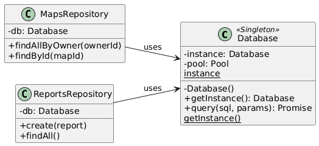

**Фрагмент программного кода:**  

```js
 const { Pool } = require("pg");

class Database {
  static instance = null;

  constructor() {
    if (Database.instance) {
      return Database.instance;
    }

    this.pool = new Pool({
      host: process.env.DB_HOST || "db",
      port: parseInt(process.env.DB_PORT || "5432", 10),
      user: process.env.DB_USER || "mental",
      password: process.env.DB_PASSWORD || "mental",
      database: process.env.DB_NAME || "mental_maps"
    });

    Database.instance = this;
  }

  static getInstance() {
    if (!Database.instance) {
      Database.instance = new Database();
    }
    return Database.instance;
  }

  async query(sql, params = []) {
    return this.pool.query(sql, params);
  }
}

module.exports = { Database };
```

**Вывод:**  
Использование Singleton в проекте *Mental Maps* позволяет реализовать единую точку доступа к базе данных и сделать архитектуру серверной части более устойчивой и предсказуемой.

---

### 2. Factory Method

**Название:** Factory Method (Фабричный метод)

**Общее назначение:**  
Шаблон Factory Method определяет интерфейс для создания объектов, но позволяет подклассам решать, какой именно объект должен быть создан.

**Назначение в проекте:**  
В проекте *Mental Maps* Factory Method используется для создания различных типов элементов карты.  
Элемент карты может быть представлен в разных формах, например:
- точка интереса (`PointElement`);
- заметка (`NoteElement`);
- маршрут (`RouteElement`).

При добавлении элемента через серверный endpoint `POST /maps/:mapId/elements` backend получает тип элемента из запроса и должен создать соответствующий объект.  
Если создавать такие объекты напрямую в роуте, код станет громоздким и плохо расширяемым. Использование фабричного метода позволяет вынести логику создания элементов в отдельные классы-фабрики.

**Практическая польза для проекта:**
- уменьшается связность кода;
- логика создания объектов выносится из маршрутов;
- упрощается добавление новых типов элементов карты.

**UML-диаграмма:**  
 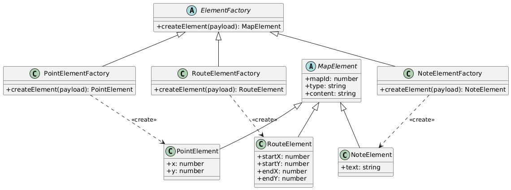

**Фрагмент программного кода:**  
```js
class MapElement {
  constructor(mapId, type, x, y, content = "", style = {}) {
    this.mapId = mapId;
    this.type = type;
    this.x = x;
    this.y = y;
    this.content = content;
    this.style = style;
  }
}

class PointElement extends MapElement {
  constructor(mapId, x, y, content = "", style = {}) {
    super(mapId, "point", x, y, content, style);
  }
}

class NoteElement extends MapElement {
  constructor(mapId, x, y, content = "", style = {}) {
    super(mapId, "note", x, y, content, style);
  }
}

class RouteElement extends MapElement {
  constructor(mapId, startX, startY, endX, endY, content = "", style = {}) {
    super(
      mapId,
      "route",
      startX,
      startY,
      content,
      {
        ...style,
        endX,
        endY
      }
    );
  }
}

class ElementFactory {
  createElement(_payload) {
    throw new Error("Метод createElement должен быть переопределён");
  }
}

class PointElementFactory extends ElementFactory {
  createElement(payload) {
    return new PointElement(
      payload.mapId,
      payload.x,
      payload.y,
      payload.content,
      payload.style
    );
  }
}

class NoteElementFactory extends ElementFactory {
  createElement(payload) {
    return new NoteElement(
      payload.mapId,
      payload.x,
      payload.y,
      payload.content,
      payload.style
    );
  }
}

class RouteElementFactory extends ElementFactory {
  createElement(payload) {
    return new RouteElement(
      payload.mapId,
      payload.startX,
      payload.startY,
      payload.endX,
      payload.endY,
      payload.content,
      payload.style
    );
  }
}

module.exports = {
  PointElementFactory,
  NoteElementFactory,
  RouteElementFactory
};
```

**Вывод:**  
Factory Method делает код создания элементов карты более структурированным и расширяемым, что особенно важно для дальнейшего развития проекта.

---

### 3. Builder

**Название:** Builder (Строитель)

**Общее назначение:**  
Шаблон Builder позволяет пошагово создавать сложный объект, отделяя процесс его конструирования от итогового представления.

**Назначение в проекте:**  
В проекте *Mental Maps* шаблон Builder используется для построения расширенного ответа по карте.  
Например, при обращении к endpoint `GET /maps/:mapId` сервер может возвращать не только основные данные карты, но и:
- список элементов карты;
- сведения о правах доступа текущего пользователя;
- дополнительные метаданные.

Такой объект формируется постепенно, поэтому Builder позволяет сделать код более понятным и избежать перегруженного контроллера.

**Практическая польза для проекта:**
- упрощается формирование сложного JSON-ответа;
- контроллеры становятся чище;
- структура ответа собирается по шагам и легче расширяется.

**UML-диаграмма:**  
 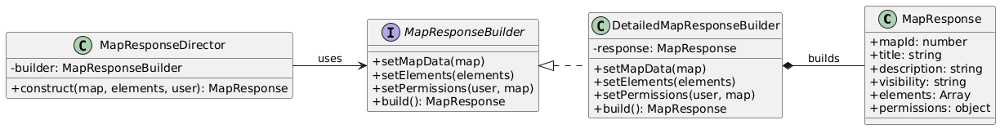

**Фрагмент программного кода:**  
```js
class DetailedMapResponseBuilder {
  constructor() {
    this.response = {};
  }

  setMapData(map) {
    this.response.mapId = map.map_id;
    this.response.ownerId = map.owner_id;
    this.response.title = map.title;
    this.response.description = map.description;
    this.response.visibility = map.visibility;
    this.response.createdAt = map.created_at;
    this.response.updatedAt = map.updated_at;
    return this;
  }

  setElements(elements) {
    this.response.elements = elements.map(el => ({
      elementId: el.element_id,
      type: el.type,
      x: el.x,
      y: el.y,
      content: el.content
    }));
    return this;
  }

  setPermissions(user, map) {
    this.response.permissions = {
      canEdit: user.role === "moderator" || user.id === map.owner_id,
      canDelete: user.role === "moderator" || user.id === map.owner_id
    };
    return this;
  }

  build() {
    return this.response;
  }
}

class MapResponseDirector {
  constructor(builder) {
    this.builder = builder;
  }

  construct(map, elements, user) {
    return this.builder
      .setMapData(map)
      .setElements(elements)
      .setPermissions(user, map)
      .build();
  }
}

module.exports = { DetailedMapResponseBuilder, MapResponseDirector };
```

**Вывод:**  
Шаблон Builder позволяет аккуратно формировать составной ответ сервера и делает код backend-логики более читаемым и поддерживаемым.

---

## II. Структурные шаблоны

### 1. Adapter

**Название:** Adapter (Адаптер)

**Общее назначение:**  
Шаблон Adapter используется для преобразования одного интерфейса в другой, ожидаемый клиентом.  
Он позволяет совместить классы и структуры данных, которые изначально несовместимы по формату.

**Назначение в проекте:**  
В проекте *Mental Maps* шаблон Adapter используется для преобразования строк, возвращаемых из PostgreSQL, в объекты API-ответа.  
База данных возвращает поля в формате `snake_case` (`map_id`, `owner_id`, `created_at`), а клиентская часть и REST API используют формат `camelCase` (`mapId`, `ownerId`, `createdAt`).

Сейчас это преобразование частично выполняется прямо в маршрутах `maps.js` и `reports.js`, что перегружает код контроллеров.  
Использование адаптера позволяет вынести преобразование в отдельный слой.

**Назначение согласно реализуемому функционалу:**  
Adapter используется:
- при возврате карты (`GET /maps/:mapId`);
- при возврате списка карт (`GET /maps`);
- при возврате элементов карты (`GET /maps/:mapId/elements`);
- при возврате жалоб (`GET /reports`).

**UML-диаграмма:**  
 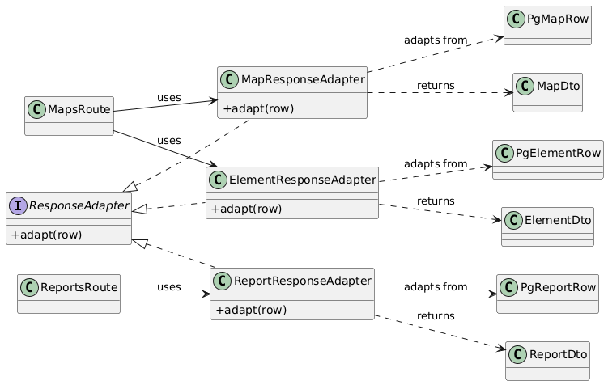

**Фрагмент программного кода:**  
```js
class MapResponseAdapter {
  adapt(row) {
    return {
      mapId: row.map_id,
      ownerId: row.owner_id,
      title: row.title,
      description: row.description,
      visibility: row.visibility,
      createdAt: row.created_at,
      updatedAt: row.updated_at
    };
  }
}

class ElementResponseAdapter {
  adapt(row) {
    return {
      elementId: row.element_id,
      mapId: row.map_id,
      type: row.type,
      x: row.x,
      y: row.y,
      content: row.content,
      style: row.style,
      createdAt: row.created_at
    };
  }
}

class ReportResponseAdapter {
  adapt(row) {
    return {
      reportId: row.report_id,
      mapId: row.map_id,
      authorId: row.author_id,
      reason: row.reason,
      comment: row.comment,
      status: row.status,
      createdAt: row.created_at
    };
  }
}

module.exports = {
  MapResponseAdapter,
  ElementResponseAdapter,
  ReportResponseAdapter
};
```

**Вывод:**  
Adapter позволяет отделить формат хранения данных в БД от формата, используемого в API, и делает код маршрутов чище и понятнее.

---

### 2. Facade

**Название:** Facade (Фасад)

**Общее назначение:**  
Шаблон Facade предоставляет единый упрощённый интерфейс к набору подсистем.  
Он скрывает внутреннюю сложность и уменьшает количество прямых зависимостей.

**Назначение в проекте:**  
В проекте *Mental Maps* шаблон Facade используется для объединения нескольких операций, необходимых для работы с картой.  
Например, для получения полной информации о карте необходимо:
- получить саму карту из таблицы `maps`;
- получить связанные элементы из таблицы `elements`;
- преобразовать данные в API-ответ;
- при необходимости проверить права пользователя.

Если выполнять всё это прямо в роуте, код становится перегруженным.  
Фасад выносит эту логику в отдельный класс `MapsFacade`.

**Назначение согласно реализуемому функционалу:**  
Facade подходит для операций:
- `GET /maps/:mapId` — получение карты вместе с элементами;
- `POST /maps/:mapId/elements` — добавление элемента и обновление карты;
- `GET /maps` — получение списка карт пользователя.

**UML-диаграмма:**  
 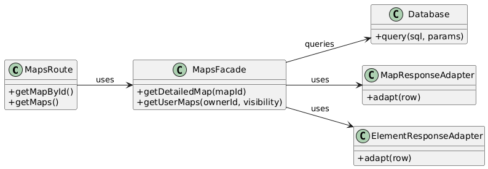

**Фрагмент программного кода:**  
```js
const { query } = require("../db");
const {
  MapResponseAdapter,
  ElementResponseAdapter
} = require("../adapters/ResponseAdapters");

class MapsFacade {
  constructor() {
    this.mapAdapter = new MapResponseAdapter();
    this.elementAdapter = new ElementResponseAdapter();
  }

  async getDetailedMap(mapId) {
    const mapRes = await query(
      `SELECT map_id, owner_id, title, description, visibility, created_at, updated_at
       FROM maps WHERE map_id = $1`,
      [mapId]
    );

    if (!mapRes.rows.length) {
      return null;
    }

    const elementRes = await query(
      `SELECT element_id, map_id, type, x, y, content, style, created_at
       FROM elements WHERE map_id = $1
       ORDER BY created_at ASC`,
      [mapId]
    );

    return {
      ...this.mapAdapter.adapt(mapRes.rows[0]),
      elements: elementRes.rows.map(row => this.elementAdapter.adapt(row))
    };
  }

  async getUserMaps(ownerId, visibility) {
    let sql = `SELECT map_id, owner_id, title, description, visibility, created_at, updated_at
               FROM maps WHERE owner_id = $1`;
    const params = [ownerId];

    if (visibility === "private" || visibility === "public") {
      sql += ` AND visibility = $2`;
      params.push(visibility);
    }

    sql += ` ORDER BY updated_at DESC`;

    const res = await query(sql, params);
    return res.rows.map(row => this.mapAdapter.adapt(row));
  }
}

module.exports = { MapsFacade };.
```

**Вывод:**  
Facade упрощает работу маршрутов и скрывает сложную координацию между адаптерами, запросами к БД и логикой формирования ответа.

---

### 3. Proxy

**Название:** Proxy (Заместитель)

**Общее назначение:**  
Шаблон Proxy предоставляет объект-заместитель, который контролирует доступ к другому объекту.  
Он может использоваться для защиты, кеширования, ленивой инициализации, логирования и других дополнительных задач.

**Назначение в проекте:**  
В проекте *Mental Maps* шаблон Proxy используется для контроля доступа к картам и элементам карты.  
Перед тем как вернуть карту или разрешить изменение, необходимо проверить:
- существует ли карта;
- публичная она или приватная;
- является ли текущий пользователь владельцем;
- является ли пользователь модератором.

Сейчас такая логика частично находится прямо в `maps.js` в функциях `canRead` и `canWrite`.  
С использованием Proxy проверка доступа выносится в отдельный объект `AuthorizedMapsProxy`, который оборачивает сервис работы с картами.

**Назначение согласно реализуемому функционалу:**  
Proxy используется при:
- `GET /maps/:mapId`;
- `GET /maps/:mapId/elements`;
- `POST /maps/:mapId/elements`.

**UML-диаграмма:**  
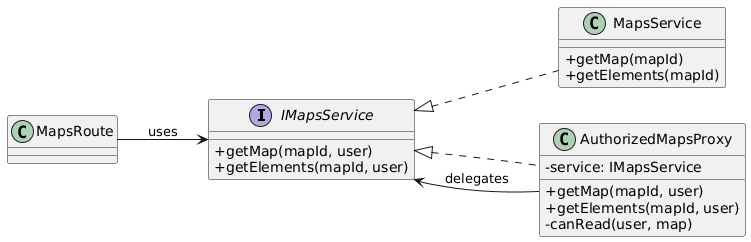


**Фрагмент программного кода MapsService:**  
```js
const { query } = require("../db");

class MapsService {
  async getMap(mapId) {
    const res = await query(
      `SELECT map_id, owner_id, title, description, visibility, created_at, updated_at
       FROM maps WHERE map_id = $1`,
      [mapId]
    );
    return res.rows[0] || null;
  }

  async getElements(mapId) {
    const res = await query(
      `SELECT element_id, map_id, type, x, y, content, style, created_at
       FROM elements WHERE map_id = $1
       ORDER BY created_at ASC`,
      [mapId]
    );
    return res.rows;
  }
}

module.exports = { MapsService };
```

**Фрагмент программного кода AuthorizedMapsProxy:**  
```js
const { httpError } = require("../utils/errors");

class AuthorizedMapsProxy {
  constructor(service) {
    this.service = service;
  }

  canRead(user, map) {
    if (map.visibility === "public") return true;
    if (user.role === "moderator") return true;
    return map.owner_id === user.id;
  }

  async getMap(mapId, user) {
    const map = await this.service.getMap(mapId);
    if (!map) throw httpError(404, "NOT_FOUND", "Карта не найдена");

    if (!this.canRead(user, map)) {
      throw httpError(403, "FORBIDDEN", "Недостаточно прав для просмотра карты");
    }

    return map;
  }

  async getElements(mapId, user) {
    const map = await this.getMap(mapId, user);
    return this.service.getElements(map.map_id);
  }
}

module.exports = { AuthorizedMapsProxy };
```

**Вывод:**  
Proxy позволяет вынести контроль доступа из маршрутов и централизовать проверку прав пользователя.

---

### 4. Decorator

**Название:** Decorator (Декоратор)

**Общее назначение:**  
Шаблон Decorator позволяет динамически добавлять объекту новую функциональность, не изменяя его исходный класс.

**Назначение в проекте:**  
В проекте *Mental Maps* шаблон Decorator используется для добавления логирования к сервису работы с картами.  
Это позволяет фиксировать вызовы методов, время выполнения и параметры операций, не изменяя код основного сервиса.

Такой подход полезен для серверной части, поскольку:
- не изменяет основную бизнес-логику;
- позволяет подключать и отключать дополнительное поведение;
- хорошо сочетается с Proxy и сервисным слоем.

**Назначение согласно реализуемому функционалу:**  
Decorator может использоваться для логирования операций:
- получения карты;
- получения элементов карты;
- создания элементов;
- получения списка карт.

**UML-диаграмма:**  
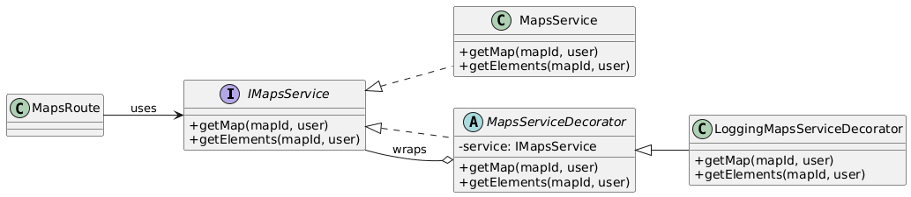

**Фрагмент программного кода:** 
```js
class MapsServiceDecorator {
  constructor(service) {
    this.service = service;
  }

  async getMap(mapId, user) {
    return this.service.getMap(mapId, user);
  }

  async getElements(mapId, user) {
    return this.service.getElements(mapId, user);
  }
}

class LoggingMapsServiceDecorator extends MapsServiceDecorator {
  async getMap(mapId, user) {
    console.log(`[MapsService] getMap start: mapId=${mapId}, user=${user.id}`);
    const result = await super.getMap(mapId, user);
    console.log(`[MapsService] getMap end: mapId=${mapId}`);
    return result;
  }

  async getElements(mapId, user) {
    console.log(`[MapsService] getElements start: mapId=${mapId}, user=${user.id}`);
    const result = await super.getElements(mapId, user);
    console.log(`[MapsService] getElements end: mapId=${mapId}, count=${result.length}`);
    return result;
  }
}

module.exports = { MapsServiceDecorator, LoggingMapsServiceDecorator };
```

**Вывод:**  
Decorator позволяет расширять функциональность сервиса без изменения его основного кода, что соответствует принципу открытости/закрытости.

---

## III. Поведенческие шаблоны

### 1. Strategy

**Название:** Strategy (Стратегия)

**Общее назначение:**  
Шаблон Strategy определяет семейство алгоритмов, инкапсулирует каждый из них и делает их взаимозаменяемыми.

**Назначение в проекте:**  
В проекте *Mental Maps* шаблон Strategy используется для валидации различных типов элементов карты.  
Элементы карты (`point`, `note`, `route`) имеют разный набор обязательных полей, поэтому единая проверка в маршруте `POST /maps/:mapId/elements` быстро становится громоздкой.  
Вынесение логики в отдельные стратегии позволяет выбирать нужный алгоритм проверки в зависимости от типа элемента.

**Назначение согласно реализуемому функционалу:**  
Strategy применяется при обработке запроса создания элемента карты:
- `point` → проверка координат `x`, `y`;
- `note` → проверка текста и позиции;
- `route` → проверка начальных и конечных координат.

**UML-диаграмма:**  
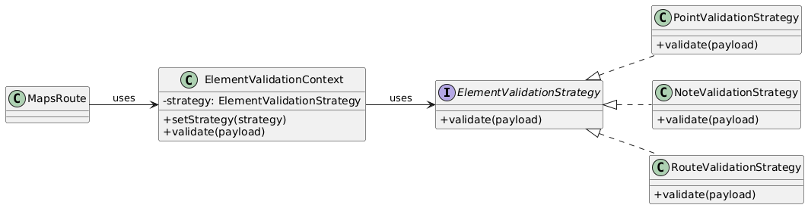

**Фрагмент программного кода:**  
```js
class ElementValidationStrategy {
  validate(_payload) {
    throw new Error("Метод validate должен быть переопределён");
  }
}

class PointValidationStrategy extends ElementValidationStrategy {
  validate(payload) {
    const errors = [];
    if (typeof payload.x !== "number") errors.push({ field: "x", issue: "must be number" });
    if (typeof payload.y !== "number") errors.push({ field: "y", issue: "must be number" });
    return errors;
  }
}

class NoteValidationStrategy extends ElementValidationStrategy {
  validate(payload) {
    const errors = [];
    if (typeof payload.x !== "number") errors.push({ field: "x", issue: "must be number" });
    if (typeof payload.y !== "number") errors.push({ field: "y", issue: "must be number" });
    if (!payload.content || typeof payload.content !== "string") {
      errors.push({ field: "content", issue: "required string" });
    }
    return errors;
  }
}

class RouteValidationStrategy extends ElementValidationStrategy {
  validate(payload) {
    const errors = [];
    if (typeof payload.startX !== "number") errors.push({ field: "startX", issue: "must be number" });
    if (typeof payload.startY !== "number") errors.push({ field: "startY", issue: "must be number" });
    if (typeof payload.endX !== "number") errors.push({ field: "endX", issue: "must be number" });
    if (typeof payload.endY !== "number") errors.push({ field: "endY", issue: "must be number" });
    return errors;
  }
}

class ElementValidationContext {
  constructor(strategy) {
    this.strategy = strategy;
  }

  setStrategy(strategy) {
    this.strategy = strategy;
  }

  validate(payload) {
    return this.strategy.validate(payload);
  }
}

function resolveValidationStrategy(type) {
  switch (type) {
    case "point":
      return new PointValidationStrategy();
    case "note":
      return new NoteValidationStrategy();
    case "route":
      return new RouteValidationStrategy();
    default:
      throw new Error("Неизвестный тип элемента");
  }
}

module.exports = {
  ElementValidationStrategy,
  PointValidationStrategy,
  NoteValidationStrategy,
  RouteValidationStrategy,
  ElementValidationContext,
  resolveValidationStrategy
};
```

**Вывод:**  
Strategy делает код маршрута чище и позволяет добавлять новые типы элементов без переписывания общей логики.

---

### 2. Command

**Название:** Command (Команда)

**Общее назначение:**  
Шаблон Command инкапсулирует запрос как отдельный объект, позволяя параметризовать клиентов командами, откладывать выполнение, логировать действия и строить историю операций.

**Назначение в проекте:**  
В проекте *Mental Maps* Command используется для представления основных действий пользователя как отдельных команд:
- создание карты;
- добавление элемента карты;
- создание жалобы.

Это особенно удобно, когда нужно отделить обработчик HTTP-запроса от фактической логики выполнения операции.

**Назначение согласно реализуемому функционалу:**  
Command может использоваться в маршрутах:
- `POST /maps`
- `POST /maps/:mapId/elements`
- `POST /reports`

**UML-диаграмма:**  
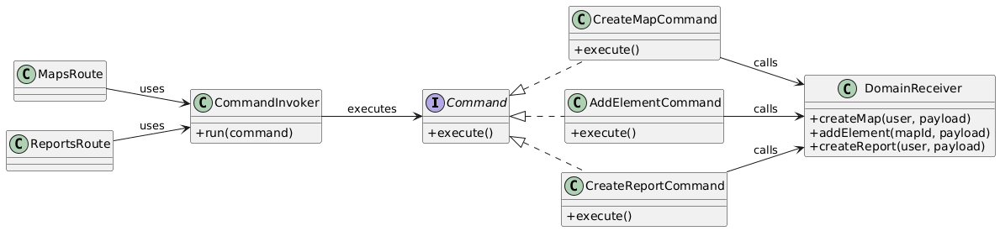

**Фрагмент программного кода:**  
```js
const { query } = require("../db");

class Command {
  async execute() {
    throw new Error("Метод execute должен быть переопределён");
  }
}

class DomainReceiver {
  async createMap(user, payload) {
    const res = await query(
      `INSERT INTO maps(owner_id, title, description, visibility, created_at, updated_at)
       VALUES ($1, $2, $3, $4, NOW(), NOW())
       RETURNING *`,
      [user.id, payload.title, payload.description || "", payload.visibility || "private"]
    );
    return res.rows[0];
  }

  async addElement(mapId, payload) {
    const res = await query(
      `INSERT INTO elements(map_id, type, x, y, content, style, created_at)
       VALUES ($1, $2, $3, $4, $5, $6, NOW())
       RETURNING *`,
      [mapId, payload.type, payload.x, payload.y, payload.content || "", payload.style || {}]
    );
    return res.rows[0];
  }

  async createReport(user, payload) {
    const res = await query(
      `INSERT INTO reports(map_id, author_id, reason, comment, status, created_at)
       VALUES ($1, $2, $3, $4, 'new', NOW())
       RETURNING *`,
      [payload.mapId, user.id, payload.reason, payload.comment || ""]
    );
    return res.rows[0];
  }
}

class CreateMapCommand extends Command {
  constructor(receiver, user, payload) {
    super();
    this.receiver = receiver;
    this.user = user;
    this.payload = payload;
  }

  async execute() {
    return this.receiver.createMap(this.user, this.payload);
  }
}

class AddElementCommand extends Command {
  constructor(receiver, mapId, payload) {
    super();
    this.receiver = receiver;
    this.mapId = mapId;
    this.payload = payload;
  }

  async execute() {
    return this.receiver.addElement(this.mapId, this.payload);
  }
}

class CreateReportCommand extends Command {
  constructor(receiver, user, payload) {
    super();
    this.receiver = receiver;
    this.user = user;
    this.payload = payload;
  }

  async execute() {
    return this.receiver.createReport(this.user, this.payload);
  }
}

class CommandInvoker {
  async run(command) {
    return command.execute();
  }
}

module.exports = {
  DomainReceiver,
  CreateMapCommand,
  AddElementCommand,
  CreateReportCommand,
  CommandInvoker
};
```

**Вывод:**  
Command позволяет сделать серверные операции более модульными и подготовить архитектуру к журналированию, очередям и откату действий.

---

### 3. Observer

**Название:** Observer (Наблюдатель)

**Общее назначение:**  
Шаблон Observer определяет зависимость «один ко многим» между объектами так, чтобы при изменении состояния одного объекта все зависимые объекты автоматически уведомлялись.

**Назначение в проекте:**  
В проекте *Mental Maps* Observer используется для обработки доменных событий.  
Например, после создания карты или жалобы система может:
- записать событие в лог;
- отправить уведомление модератору;
- зафиксировать событие аналитики.

При этом маршрут не должен знать о всех этих действиях — он просто публикует событие.

**Назначение согласно реализуемому функционалу:**  
Observer может применяться после:
- `POST /maps`
- `POST /reports`

**UML-диаграмма:**  
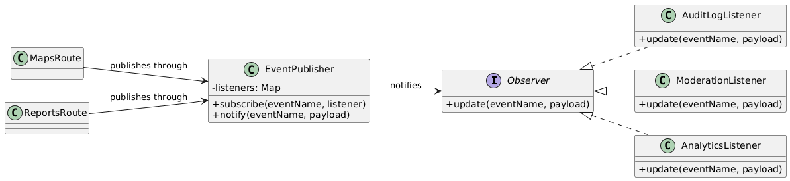

**Фрагмент программного кода:**  
```js
class EventPublisher {
  constructor() {
    this.listeners = {};
  }

  subscribe(eventName, listener) {
    if (!this.listeners[eventName]) {
      this.listeners[eventName] = [];
    }
    this.listeners[eventName].push(listener);
  }

  notify(eventName, payload) {
    const listeners = this.listeners[eventName] || [];
    for (const listener of listeners) {
      listener.update(eventName, payload);
    }
  }
}

class AuditLogListener {
  update(eventName, payload) {
    console.log(`[AUDIT] event=${eventName}`, payload);
  }
}

class ModerationListener {
  update(eventName, payload) {
    if (eventName === "report.created") {
      console.log(`[MODERATION] new report received`, payload);
    }
  }
}

class AnalyticsListener {
  update(eventName, payload) {
    console.log(`[ANALYTICS] event=${eventName}`, payload);
  }
}

module.exports = {
  EventPublisher,
  AuditLogListener,
  ModerationListener,
  AnalyticsListener
};
```

**Вывод:**  
Observer позволяет отделить основные действия системы от побочных реакций и уменьшает связанность компонентов.

---

### 4. Template Method

**Название:** Template Method (Шаблонный метод)

**Общее назначение:**  
Шаблон Template Method определяет общий скелет алгоритма в базовом классе, позволяя подклассам переопределять отдельные шаги без изменения структуры алгоритма в целом.

**Назначение в проекте:**  
В проекте *Mental Maps* Template Method используется для организации общего алгоритма обработки защищённых create-операций.  
Многие POST-обработчики имеют одинаковую структуру:
1. проверка авторизации;
2. валидация входных данных;
3. подготовка объекта;
4. сохранение в БД;
5. формирование ответа.

Этот повторяющийся алгоритм можно вынести в базовый класс, а различия между созданием карты и созданием жалобы оформить в подклассах.

**Назначение согласно реализуемому функционалу:**  
Template Method подходит для:
- `POST /maps`
- `POST /reports`

**UML-диаграмма:**  
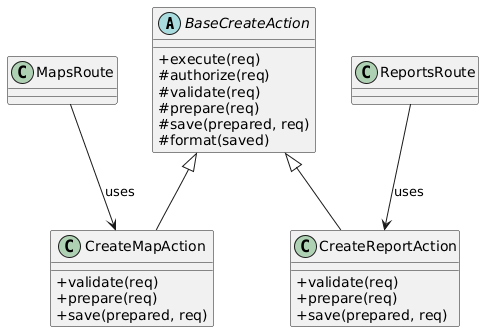


**Фрагмент программного кода:**  
```js
class BaseCreateAction {
  async execute(req) {
    this.authorize(req);
    this.validate(req);
    const prepared = this.prepare(req);
    const saved = await this.save(prepared, req);
    return this.format(saved);
  }

  authorize(_req) {
    // по умолчанию ничего не делает
  }

  validate(_req) {
    throw new Error("Метод validate должен быть переопределён");
  }

  prepare(_req) {
    throw new Error("Метод prepare должен быть переопределён");
  }

  async save(_prepared, _req) {
    throw new Error("Метод save должен быть переопределён");
  }

  format(saved) {
    return saved;
  }
}

class CreateMapAction extends BaseCreateAction {
  constructor(receiver) {
    super();
    this.receiver = receiver;
  }

  validate(req) {
    if (!req.body.title) {
      throw new Error("Поле title обязательно");
    }
  }

  prepare(req) {
    return {
      title: req.body.title,
      description: req.body.description || "",
      visibility: req.body.visibility || "private"
    };
  }

  async save(prepared, req) {
    return this.receiver.createMap(req.user, prepared);
  }
}

class CreateReportAction extends BaseCreateAction {
  constructor(receiver) {
    super();
    this.receiver = receiver;
  }

  validate(req) {
    if (!req.body.mapId) throw new Error("Поле mapId обязательно");
    if (!req.body.reason) throw new Error("Поле reason обязательно");
  }

  prepare(req) {
    return {
      mapId: req.body.mapId,
      reason: req.body.reason,
      comment: req.body.comment || ""
    };
  }

  async save(prepared, req) {
    return this.receiver.createReport(req.user, prepared);
  }
}

module.exports = {
  BaseCreateAction,
  CreateMapAction,
  CreateReportAction
};
```

**Вывод:**  
Template Method уменьшает дублирование кода и делает обработчики запросов более единообразными.

---

### 5. Chain of Responsibility

**Название:** Chain of Responsibility (Цепочка обязанностей)

**Общее назначение:**  
Шаблон Chain of Responsibility позволяет передавать запрос последовательно по цепочке обработчиков, пока один из них не обработает запрос или не отклонит его.

**Назначение в проекте:**  
В проекте *Mental Maps* Chain of Responsibility используется для последовательной проверки запроса на создание элемента карты.  
Перед тем как сохранить элемент, необходимо:
- убедиться, что пользователь авторизован;
- проверить существование карты;
- проверить права доступа;
- проверить корректность payload.

Такой набор шагов удобно оформить в виде цепочки обработчиков.

**Назначение согласно реализуемому функционалу:**  
Chain of Responsibility применяется в маршруте:
- `POST /maps/:mapId/elements`

**UML-диаграмма:**  
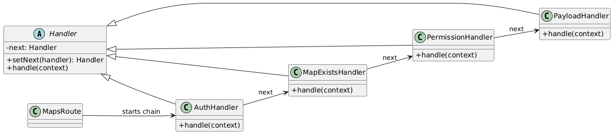

**Фрагмент программного кода:**  

```js
const { query } = require("../db");
const { httpError } = require("../utils/errors");

class Handler {
  setNext(handler) {
    this.next = handler;
    return handler;
  }

  async handle(context) {
    if (this.next) {
      return this.next.handle(context);
    }
    return context;
  }
}

class AuthHandler extends Handler {
  async handle(context) {
    if (!context.req.user) {
      throw httpError(401, "UNAUTHORIZED", "Пользователь не авторизован");
    }
    return super.handle(context);
  }
}

class MapExistsHandler extends Handler {
  async handle(context) {
    const mapRes = await query(
      `SELECT map_id, owner_id, visibility FROM maps WHERE map_id = $1`,
      [context.req.params.mapId]
    );

    if (!mapRes.rows.length) {
      throw httpError(404, "NOT_FOUND", "Карта не найдена");
    }

    context.map = mapRes.rows[0];
    return super.handle(context);
  }
}

class PermissionHandler extends Handler {
  async handle(context) {
    const { req, map } = context;
    const canEdit = req.user.role === "moderator" || req.user.id === map.owner_id;

    if (!canEdit) {
      throw httpError(403, "FORBIDDEN", "Недостаточно прав для изменения карты");
    }

    return super.handle(context);
  }
}

class PayloadHandler extends Handler {
  async handle(context) {
    const { type } = context.req.body;

    if (!type || typeof type !== "string") {
      throw httpError(400, "VALIDATION_ERROR", "Поле type обязательно");
    }

    return super.handle(context);
  }
}

module.exports = {
  Handler,
  AuthHandler,
  MapExistsHandler,
  PermissionHandler,
  PayloadHandler
};
```

**Вывод:**  
Chain of Responsibility позволяет разделить этапы валидации и сделать код обработки запроса более модульным и расширяемым.

---

### Общий вывод по поведенческим шаблонам

В проекте *Mental Maps* были выбраны и применены пять поведенческих шаблонов GoF:

- **Strategy** — для разных алгоритмов валидации элементов карты;
- **Command** — для инкапсуляции действий пользователя как объектов;
- **Observer** — для реакции на доменные события;
- **Template Method** — для унификации структуры create-обработчиков;
- **Chain of Responsibility** — для пошаговой проверки запросов.

Эти шаблоны позволяют сделать backend-код более гибким, уменьшить связность и упростить развитие серверной логики.
